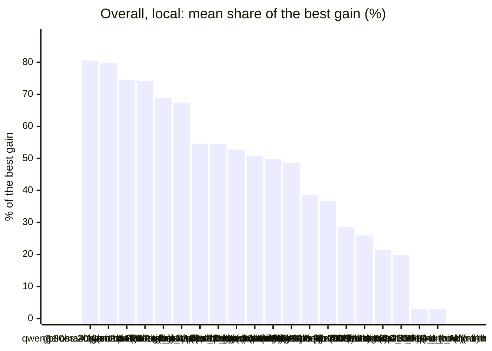
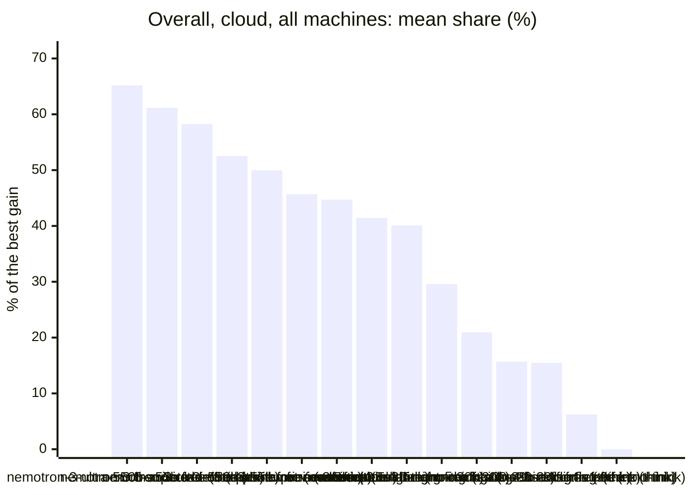
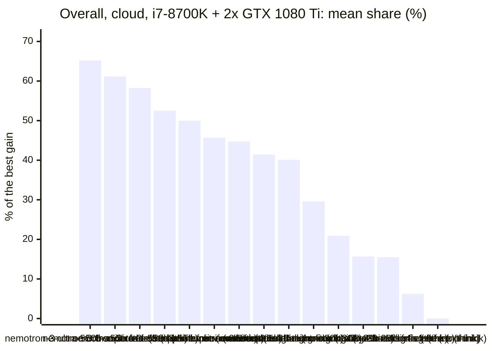

<!-- Copyright (c) 2026 by C. Klukas -->
<!-- SPDX-License-Identifier: GPL-3.0-only -->
<!-- Generated by `omega report` from bench/results/*.json. Do not edit by hand. -->

# Model benchmarks

Each row is one OMEGA TRANSFORM search with the same budget and settings, with
only the model changed: at most 60 minutes, ended earlier once 15 model answers
in a row brought no new best that is at least 0.1% better, and the same token
limits per answer with and without reasoning, for local and cloud models alike.
The numbers come from the committed result files in `bench/results/`; rerun
`omega bench` to add new ones (see [Benchmarking models](benchmarking.md)).

Read the results with care: one run is a single sample of a stochastic
search. Repeated runs, from one machine or several, are all kept: the pages
show their mean and spread, and the ranking ties models whose ranges overlap.
Timing-based scores (the C++ examples) depend on the machine and on what else
it was doing, so machines are compared through their own shares only.

## Pages

| Page | What it shows |
|---|---|
| [Models by developer](benchmarks/developers.md) | who develops each model, the ranking grouped by developer, and each developer's progress over time |
| [Models by country](benchmarks/countries.md) | the best model of each country |
| [Model check](benchmarks/model-check.md) | which installed models were usable before the benchmark |
| [bin_packing_1d](benchmarks/bin_packing_1d.md) | 35 models on this example: scores, speed, memory and progress over time |
| [circles_in_circle_21](benchmarks/circles_in_circle_21.md) | 35 models on this example: scores, speed, memory and progress over time |
| [feature_engineering](benchmarks/feature_engineering.md) | 35 models on this example: scores, speed, memory and progress over time |
| [float_parse_single_thread](benchmarks/float_parse_single_thread.md) | 3 models on this example: scores, speed, memory and progress over time |
| [heilbronn_13](benchmarks/heilbronn_13.md) | 35 models on this example: scores, speed, memory and progress over time |
| [log_compressor](benchmarks/log_compressor.md) | 35 models on this example: scores, speed, memory and progress over time |
| [max_cut](benchmarks/max_cut.md) | 35 models on this example: scores, speed, memory and progress over time |
| [symbolic_regression](benchmarks/symbolic_regression.md) | 35 models on this example: scores, speed, memory and progress over time |
| [tammes_30](benchmarks/tammes_30.md) | 35 models on this example: scores, speed, memory and progress over time |
| [tsp_heuristic](benchmarks/tsp_heuristic.md) | 35 models on this example: scores, speed, memory and progress over time |

Machines: **i7-8700K**: Intel(R) Core(TM) i7-8700K CPU @ 3.70GHz (MS-7A98), 12 cores, 64 GB, 1 runs; **i7-8700K + 2x GTX 1080 Ti**: Intel(R) Core(TM) i7-8700K CPU @ 3.70GHz (MS-7A98), 12 cores, 64 GB, 2x NVIDIA GeForce GTX 1080 Ti, 11264 MiB, 317 runs.

## Overall ranking

Scores of different examples cannot be added up (a matrix multiply gains ×80, a route heuristic ×1.1), so every example is weighted equally: per example, each run's gain over the starting program is divided by the best **mean** gain of any model of its group there, so that one lucky run does not set the bar. A model's **share** is the mean over its runs and then over the examples (100% = the best model on every example, 0% = no gain; a run whose model never answered counts as 0%). Where models were run more than once, ± is the standard error of the share from the spread between repeated runs; in the table of all machines, a model's results on several machines count as such repeats. Ties: going down the table, a model whose range (share ± standard error) reaches the range of the first model of the current tie group gets that model's rank, marked =; without repeated runs only equal shares tie. The geometric mean of the improvement factors, the examples won, the examples without any gain and the number of runs (failed ones in brackets) are shown alongside. Only models with results on at least three quarters of the examples are ranked; the others follow without a rank. The same ranking is grouped [by developer](benchmarks/developers.md) and [by country](benchmarks/countries.md) on pages of their own. Released is the model's original publication on Hugging Face, or OpenRouter's listing date.

### Local models

| # | Model | Released | Share of best gain | Geometric-mean gain | Wins | No gain | Runs | Examples |
|--:|---|---|--:|--:|--:|--:|--:|--:|
| 1 | gpt-oss:20b (no-think) | 2025-08-04 | **81%** | ×1.94 | 3 | 0 | 9 | 9 |
| 2 | gemma4:12b-it-qat (no-think) | 2026-05-23 | **80%** | ×1.97 | 1 | 0 | 9 | 9 |
| 3 | qwen3:30b-a3b-instruct-2507-q4_K_M (no-think) | 2025-07-28 | **75%** | ×1.98 | 1 | 1 | 9 | 9 |
| 4 | gemma4:latest (no-think) | 2026-03-02 | **74%** | ×2.00 | 0 | 0 | 9 | 9 |
| 5 | gemma4:26b-a4b-it-qat (no-think) | 2026-03-11 | **69%** | ×1.95 | 1 | 1 | 9 | 9 |
| 6 | qwen3.6:27b-coding-mtp-q4_K_M (no-think) | 2026-04-21 | **67%** | ×1.78 | 3 | 1 | 9 | 9 |
| 7 | underdog-saluki-27b:iq2-mix (no-think) | 2026-10-08 | **55%** | ×1.71 | 0 | 1 | 9 | 9 |
| 8 | glm-4.7-flash:latest (no-think) | 2026-01-19 | **54%** | ×1.69 | 0 | 1 | 9 | 9 |
| 9 | qwen3.5:latest (no-think) | 2026-02-27 | **53%** | ×1.71 | 0 | 3 | 9 | 9 |
| 10 | frob/sarvam:30b (no-think) | 2026-03-03 | **51%** | ×1.63 | 0 | 3 | 9 | 9 |
| 11 | gemma4:e2b (no-think) | 2026-03-02 | **50%** | ×1.55 | 0 | 1 | 9 | 9 |
| 12 | gemma4:e4b-it-qat (no-think) | 2026-03-02 | **48%** | ×1.44 | 0 | 3 | 9 (1 failed) | 9 |
| 13 | qwen2.5-coder:7b (no-think) | 2024-09-17 | **39%** | ×1.59 | 0 | 3 | 9 | 9 |
| 14 | qwen3-coder:30b (no-think) | 2025-07-31 | **37%** | ×1.51 | 0 | 3 | 9 | 9 |
| 15 | richardyoung/frognano-4b-2609:latest (no-think) | 2026-09-17 | **29%** | ×1.56 | 0 | 2 | 9 | 9 |
| 16 | yandex/YandexGPT-5-Lite-8B-instruct-GGUF:latest (no-think) | 2025-03-28 | **26%** | ×1.48 | 0 | 4 | 9 | 9 |
| 17 | llm-jp-4-8b-omega:q4_k_m (no-think) | 2026-03-16 | **21%** | ×1.08 | 0 | 6 | 9 | 9 |
| 18 | MichelRosselli/apertus:8b-instruct-2509-q4_k_m (no-think) | 2025-08-13 | **20%** | ×1.26 | 0 | 5 | 9 | 9 |
| 19 | hf.co/LiquidAI/LFM3-1.7B-GGUF:Q4_K_M (no-think) | 2026-10-23 | **3%** | ×1.01 | 0 | 8 | 9 (1 failed) | 9 |
| 20 | nemotron-3-nano:4b (no-think) | 2026-03-07 | **3%** | ×1.15 | 0 | 7 | 9 | 9 |

```mermaid
xychart-beta
    title "Overall, local: mean share of the best gain (%)"
    x-axis ["gpt-oss:20b (no-think)", "gemma4:12b-it-qat (no-think)", "qwen3:30b-a3b-instruct-2507-q4_K_M (no-think)", "gemma4:latest (no-think)", "gemma4:26b-a4b-it-qat (no-think)", "qwen3.6:27b-coding-mtp-q4_K_M (no-think)", "underdog-saluki-27b:iq2-mix (no-think)", "glm-4.7-flash:latest (no-think)", "qwen3.5:latest (no-think)", "sarvam:30b (no-think)", "gemma4:e2b (no-think)", "gemma4:e4b-it-qat (no-think)", "qwen2.5-coder:7b (no-think)", "qwen3-coder:30b (no-think)", "frognano-4b-2609:latest (no-think)", "YandexGPT-5-Lite-8B-instruct-GGUF:latest (no-think)", "llm-jp-4-8b-omega:q4_k_m (no-think)", "apertus:8b-instruct-2509-q4_k_m (no-think)", "LFM3-1.7B-GGUF:Q4_K_M (no-think)", "nemotron-3-nano:4b (no-think)"]
    y-axis "% of the best gain" 0 --> 88.62
    bar [80.56, 79.85, 74.54, 74.17, 68.83, 67.38, 54.61, 54.47, 52.72, 50.85, 49.74, 48.5, 38.59, 36.65, 28.62, 25.95, 21.36, 19.84, 2.905, 2.891]
```

### Cloud models (OpenRouter)

Results come from several machines. Raw scores are not pooled: timing examples depend on the CPU and its C library, and a faster machine gets more model calls into the same minutes. Shares are computed per machine, against that machine's best mean gain; the combined ranking averages them over every (machine, example) cell, and each machine's own share is shown in a column. Each machine's own ranking follows.

#### All machines

| # | Model | Released | Share of best gain | On i7-8700K + 2x GTX 1080 Ti | Geometric-mean gain | Wins | No gain | Runs | Examples |
|--:|---|---|--:|--:|--:|--:|--:|--:|--:|
| 1 | nvidia/nemotron-3-ultra-550b-a55b:free (think) | 2026-06-04 | **65%** | 65% | ×1.98 | 2 | 3 | 9 (3 failed) | 9 (9 cells) |
| 2 | nvidia/nemotron-3.5-super-vl:free (think) | 2026-10-15 | **61%** | 61% | ×1.98 | 4 | 3 | 9 (3 failed) | 9 (9 cells) |
| 3 | cohere/north-mini-code:free (think) | 2026-06-17 | **58%** | 58% | ×1.87 | 0 | 3 | 9 (3 failed) | 9 (9 cells) |
| 4 | nvidia/nemotron-3-ultra-550b-a55b:free (no-think) | 2026-06-04 | **53%** | 53% | ×1.35 | 2 | 4 | 9 (3 failed) | 9 (9 cells) |
| 5 | dots-studio/dots-3-note-preview:free (no-think) | 2026-08-14 | **50%** | 50% | ×1.23 | 1 | 3 | 9 (3 failed) | 9 (9 cells) |
| 6 | dots-studio/dots-3-note-preview:free (think) | 2026-08-14 | **46%** | 46% | ×1.80 | 0 | 4 | 9 (3 failed) | 9 (9 cells) |
| 7 | cohere/north-mini-code:free (no-think) | 2026-06-17 | **45%** | 45% | ×1.27 | 0 | 4 | 9 (3 failed) | 9 (9 cells) |
| 8 | nvidia/nemotron-3.5-super-vl:free (no-think) | 2026-10-15 | **41%** | 41% | ×1.29 | 0 | 4 | 9 (4 failed) | 9 (9 cells) |
| 9 | nvidia/nemotron-3.5-lightning:free (think) | 2026-08-11 | **40%** | 40% | ×1.75 | 0 | 4 | 9 (4 failed) | 9 (9 cells) |
| 10 | nvidia/nemotron-3.5-lightning:free (no-think) | 2026-08-11 | **30%** | 30% | ×1.10 | 0 | 6 | 9 (3 failed) | 9 (9 cells) |
| 11 | nvidia/nemotron-3-nano-omni-30b-a3b-reasoning:free (think) | 2026-04-28 | **21%** | 21% | ×1.53 | 0 | 4 | 8 (3 failed) | 8 (8 cells) |
| 12 | nvidia/nemotron-3-nano-omni-30b-a3b-reasoning:free (no-think) | 2026-04-28 | **16%** | 16% | ×1.04 | 0 | 7 | 9 (3 failed) | 9 (9 cells) |
| 13 | xingchen-agi/xing4.0-29b-a4b:free (think) | 2026-10-16 | **15%** | 15% | ×1.34 | 0 | 7 | 9 (2 failed) | 9 (9 cells) |
| 14 | xingchen-agi/xing4.0-29b-a4b:free (no-think) | 2026-10-16 | **6%** | 6% | ×1.22 | 0 | 7 | 9 (1 failed) | 9 (9 cells) |
| 15 | recursive/flint-v1.0:free (think) | 2026-10-21 | **0%** | 0% | ×1.00 | 0 | 9 | 9 (9 failed) | 9 (9 cells) |

```mermaid
xychart-beta
    title "Overall, cloud, all machines: mean share (%)"
    x-axis ["nemotron-3-ultra-550b-a55b:free (think)", "nemotron-3.5-super-vl:free (think)", "north-mini-code:free (think)", "nemotron-3-ultra-550b-a55b:free (no-think)", "dots-3-note-preview:free (no-think)", "dots-3-note-preview:free (think)", "north-mini-code:free (no-think)", "nemotron-3.5-super-vl:free (no-think)", "nemotron-3.5-lightning:free (think)", "nemotron-3.5-lightning:free (no-think)", "nemotron-3-nano-omni-30b-a3b-reasoning:free (think)", "nemotron-3-nano-omni-30b-a3b-reasoning:free (no-think)", "xing4.0-29b-a4b:free (think)", "xing4.0-29b-a4b:free (no-think)", "flint-v1.0:free (think)"]
    y-axis "% of the best gain" 0 --> 71.71
    bar [65.19, 61.17, 58.25, 52.52, 49.96, 45.69, 44.72, 41.43, 40.08, 29.59, 20.92, 15.7, 15.47, 6.242, 0]
```

#### On i7-8700K + 2x GTX 1080 Ti

| # | Model | Released | Share of best gain | Geometric-mean gain | Wins | No gain | Runs | Examples |
|--:|---|---|--:|--:|--:|--:|--:|--:|
| 1 | nvidia/nemotron-3-ultra-550b-a55b:free (think) | 2026-06-04 | **65%** | ×1.98 | 2 | 3 | 9 (3 failed) | 9 |
| 2 | nvidia/nemotron-3.5-super-vl:free (think) | 2026-10-15 | **61%** | ×1.98 | 4 | 3 | 9 (3 failed) | 9 |
| 3 | cohere/north-mini-code:free (think) | 2026-06-17 | **58%** | ×1.87 | 0 | 3 | 9 (3 failed) | 9 |
| 4 | nvidia/nemotron-3-ultra-550b-a55b:free (no-think) | 2026-06-04 | **53%** | ×1.35 | 2 | 4 | 9 (3 failed) | 9 |
| 5 | dots-studio/dots-3-note-preview:free (no-think) | 2026-08-14 | **50%** | ×1.23 | 1 | 3 | 9 (3 failed) | 9 |
| 6 | dots-studio/dots-3-note-preview:free (think) | 2026-08-14 | **46%** | ×1.80 | 0 | 4 | 9 (3 failed) | 9 |
| 7 | cohere/north-mini-code:free (no-think) | 2026-06-17 | **45%** | ×1.27 | 0 | 4 | 9 (3 failed) | 9 |
| 8 | nvidia/nemotron-3.5-super-vl:free (no-think) | 2026-10-15 | **41%** | ×1.29 | 0 | 4 | 9 (4 failed) | 9 |
| 9 | nvidia/nemotron-3.5-lightning:free (think) | 2026-08-11 | **40%** | ×1.75 | 0 | 4 | 9 (4 failed) | 9 |
| 10 | nvidia/nemotron-3.5-lightning:free (no-think) | 2026-08-11 | **30%** | ×1.10 | 0 | 6 | 9 (3 failed) | 9 |
| 11 | nvidia/nemotron-3-nano-omni-30b-a3b-reasoning:free (think) | 2026-04-28 | **21%** | ×1.53 | 0 | 4 | 8 (3 failed) | 8 |
| 12 | nvidia/nemotron-3-nano-omni-30b-a3b-reasoning:free (no-think) | 2026-04-28 | **16%** | ×1.04 | 0 | 7 | 9 (3 failed) | 9 |
| 13 | xingchen-agi/xing4.0-29b-a4b:free (think) | 2026-10-16 | **15%** | ×1.34 | 0 | 7 | 9 (2 failed) | 9 |
| 14 | xingchen-agi/xing4.0-29b-a4b:free (no-think) | 2026-10-16 | **6%** | ×1.22 | 0 | 7 | 9 (1 failed) | 9 |
| 15 | recursive/flint-v1.0:free (think) | 2026-10-21 | **0%** | ×1.00 | 0 | 9 | 9 (9 failed) | 9 |

```mermaid
xychart-beta
    title "Overall, cloud, i7-8700K + 2x GTX 1080 Ti: mean share (%)"
    x-axis ["nemotron-3-ultra-550b-a55b:free (think)", "nemotron-3.5-super-vl:free (think)", "north-mini-code:free (think)", "nemotron-3-ultra-550b-a55b:free (no-think)", "dots-3-note-preview:free (no-think)", "dots-3-note-preview:free (think)", "north-mini-code:free (no-think)", "nemotron-3.5-super-vl:free (no-think)", "nemotron-3.5-lightning:free (think)", "nemotron-3.5-lightning:free (no-think)", "nemotron-3-nano-omni-30b-a3b-reasoning:free (think)", "nemotron-3-nano-omni-30b-a3b-reasoning:free (no-think)", "xing4.0-29b-a4b:free (think)", "xing4.0-29b-a4b:free (no-think)", "flint-v1.0:free (think)"]
    y-axis "% of the best gain" 0 --> 71.71
    bar [65.19, 61.17, 58.25, 52.52, 49.96, 45.69, 44.72, 41.43, 40.08, 29.59, 20.92, 15.7, 15.47, 6.242, 0]
```
