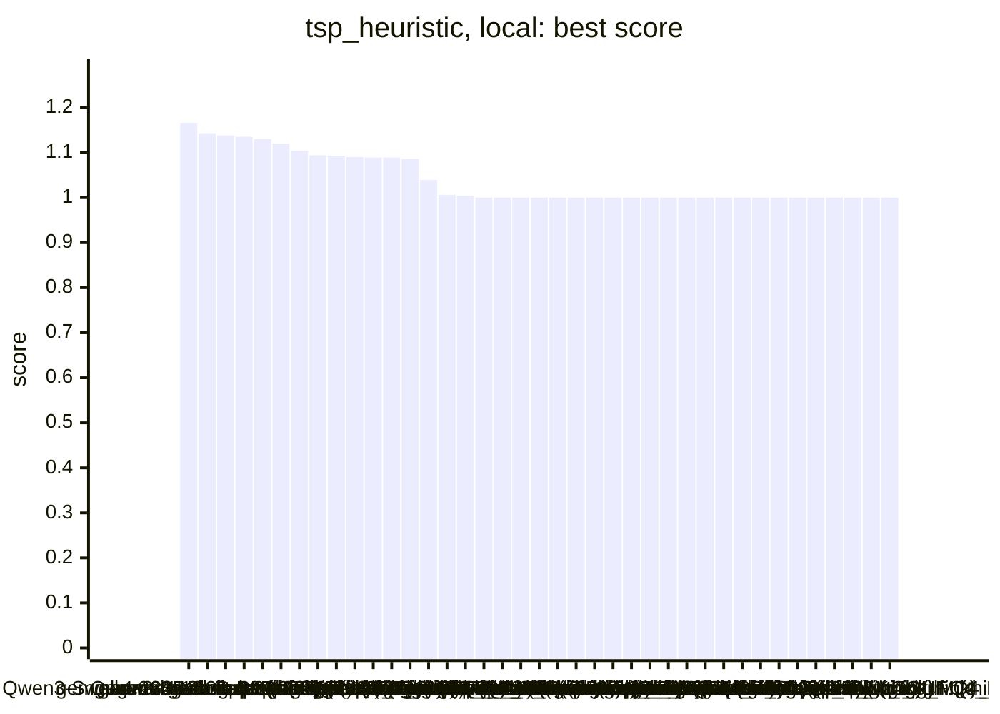
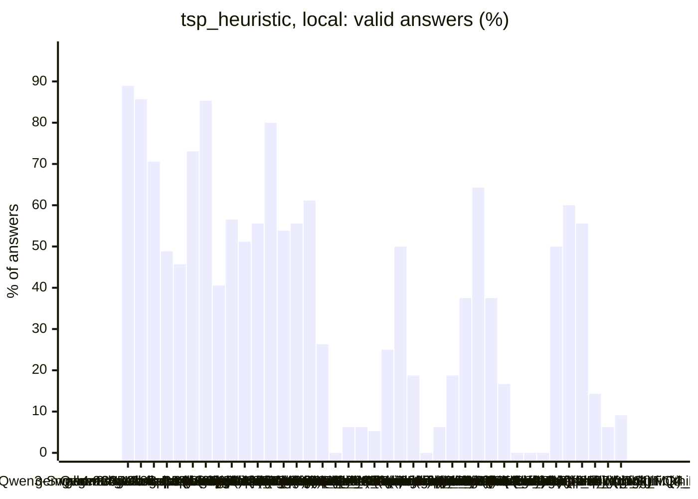
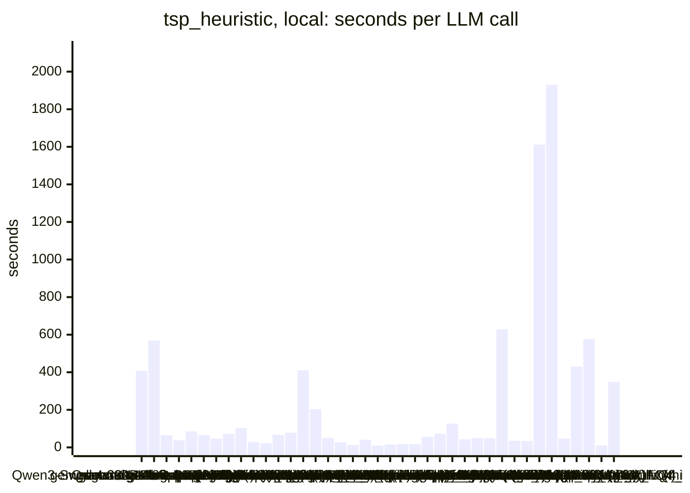
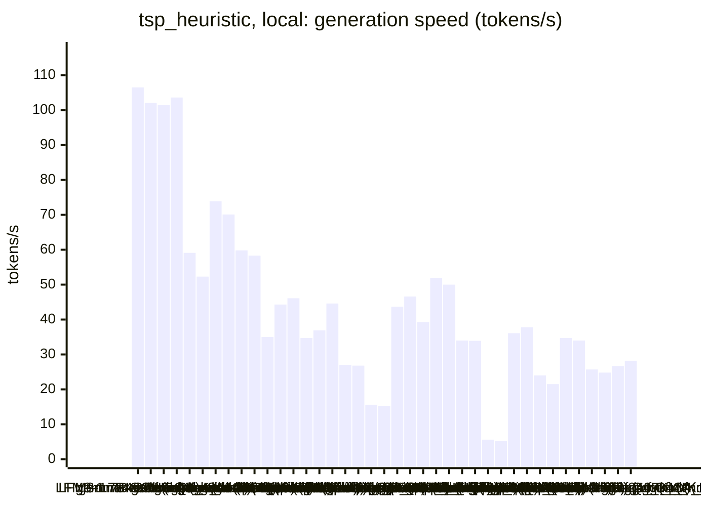
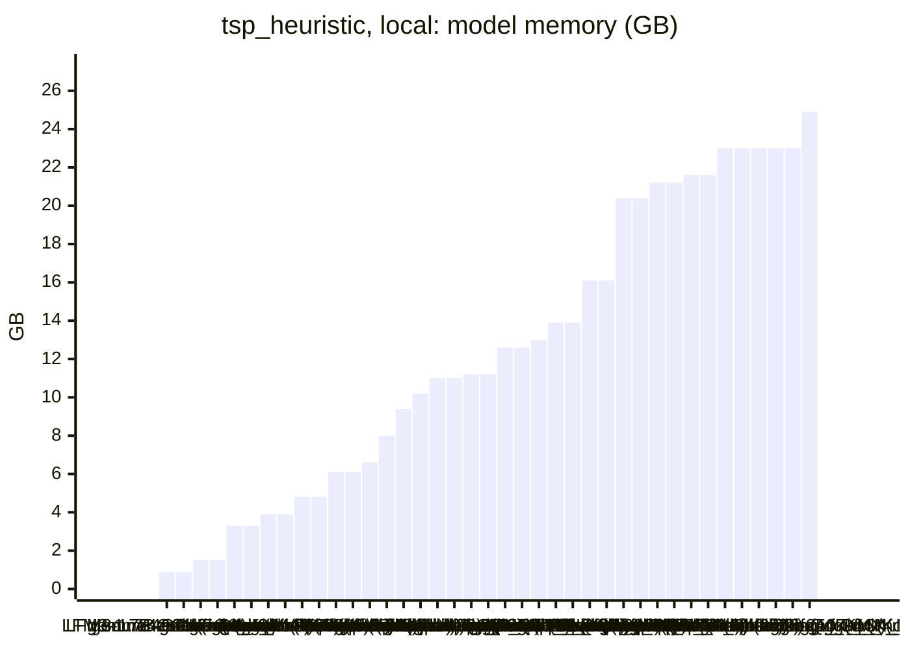
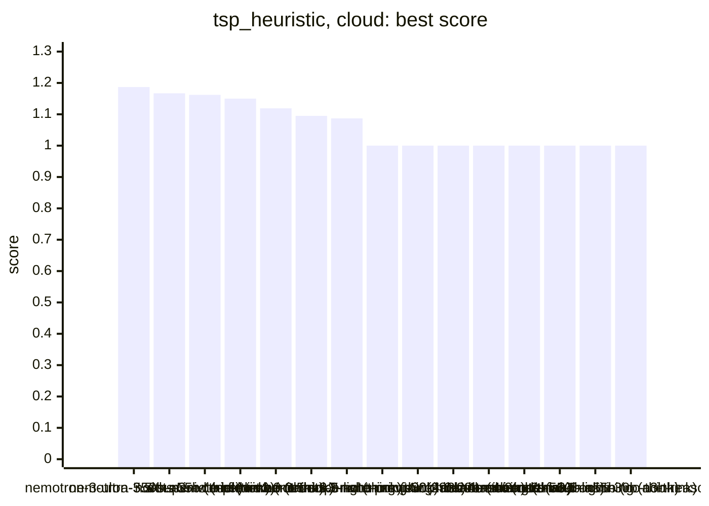
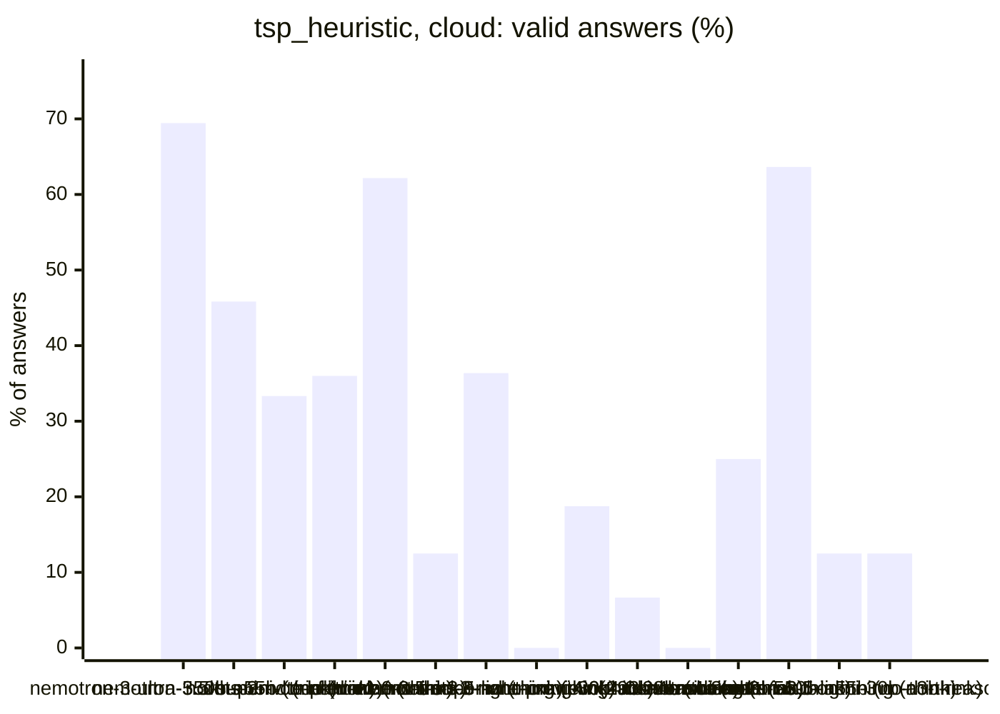
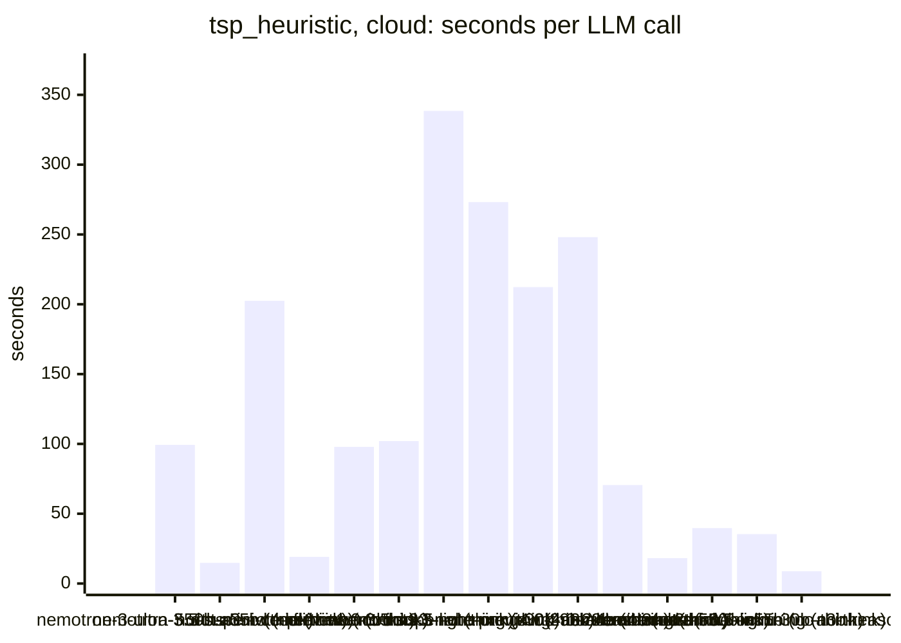
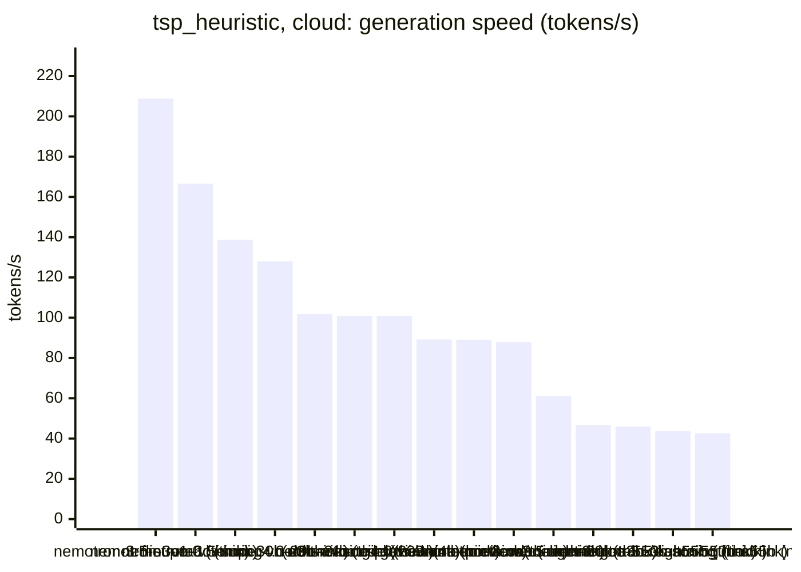

<!-- Copyright (c) 2026 by C. Klukas -->
<!-- SPDX-License-Identifier: GPL-3.0-only -->
<!-- Generated by `omega report` from bench/results/*.json. Do not edit by hand. -->

# tsp_heuristic

54 models, each run at most 60 minutes, ended earlier after 15 answers in a row without progress; one run per model. The [overall ranking](../benchmarks.md#overall-ranking) compares the models over all examples.

Machine: Intel(R) Core(TM) i7-8700K CPU @ 3.70GHz (MS-7A98), 12 cores, 64 GB, 2x NVIDIA GeForce GTX 1080 Ti, 11264 MiB.

## Local models

Ollama on this machine.

| Model | Params | Initial | Best | Gain | LLM calls | s/call | Valid | New bests | Min to best | Minutes | Stopped by |
|---|---|--:|--:|--:|--:|--:|--:|--:|--:|--:|---|
| gemma4:26b-a4b-it-qat (think) | 25.2B | 1 | **1.16584** | ×1.17 | 9 | 407 | 89% | 3 | 54.9 | 62.6 | time limit |
| gemma4:12b-it-qat (think) | 11.9B | 1 | **1.14333** | ×1.14 | 7 | 569 | 86% | 4 | 56.3 | 67.4 | time limit |
| gemma4:12b-it-qat (no-think) | 11.9B | 1 | **1.13768** | ×1.14 | 17 | 64 | 71% | 2 | 3.2 | 18.8 | no progress |
| gemma4:e4b-it-qat (no-think) | 7.5B | 1 | **1.13508** | ×1.14 | 43 | 39 | 49% | 5 | 19.5 | 28.9 | no progress |
| hf.co/mmnga-o/Qwen3-Swallow-30B-A3B-RL-v0.2-gguf:Q4_K_M (no-think) | 30.5B | 1 | **1.12987** | ×1.13 | 35 | 85 | 46% | 2 | 29.2 | 51.9 | no progress |
| gemma4:e4b-it-qat (think) | 7.5B | 1 | **1.12048** | ×1.12 | 52 | 66 | 73% | 6 | 56.3 | 59.2 | no progress |
| gpt-oss:20b (think) | 20.9B | 1 | **1.10425** | ×1.10 | 34 | 46 | 85% | 5 | 15.8 | 28.3 | no progress |
| gemma4:26b-a4b-it-qat (no-think) | 25.2B | 1 | **1.09374** | ×1.09 | 37 | 72 | 41% | 7 | 38.1 | 45.6 | no progress |
| hf.co/mmnga-o/Qwen3-Swallow-30B-A3B-RL-v0.2-gguf:Q4_K_M (think) | 30.5B | 1 | **1.09326** | ×1.09 | 23 | 103 | 57% | 2 | 25.1 | 41.4 | no progress |
| gemma4:e2b (think) | 4.6B | 1 | **1.09031** | ×1.09 | 43 | 28 | 51% | 6 | 15.5 | 21.7 | no progress |
| gemma4:latest (no-think) | 7.5B | 1 | **1.08936** | ×1.09 | 36 | 22 | 56% | 4 | 7.7 | 14.1 | no progress |
| gemma4:latest (think) | 7.5B | 1 | **1.0889** | ×1.09 | 20 | 68 | 80% | 3 | 3.6 | 23.8 | no progress |
| gpt-oss:20b (no-think) | 20.9B | 1 | **1.08584** | ×1.09 | 26 | 78 | 54% | 5 | 19.8 | 34.8 | no progress |
| qwen3.6:27b-coding-mtp-q4_K_M (no-think) | 27.3B | 1 | **1.03857** | ×1.04 | 9 | 410 | 56% | 1 | 25.8 | 62.0 | time limit |
| hf.co/LiquidAI/LFM3-1.7B-GGUF:Q4_K_M (think) | 1.73B | 1 | **1.00579** | ×1.01 | 18 | 204 | 61% | 4 | 49.3 | 61.8 | time limit |
| qwen3.5:latest (think) | 9.0B | 1 | **1.00394** | ×1.00 | 19 | 50 | 26% | 1 | 2.4 | 16.7 | no progress |
| hf.co/LiquidAI/LFM3-1.7B-GGUF:Q4_K_M (no-think) | 1.73B | 1 | **1** | ×1.00 | 16 | 27 | 0% | 0 | - | 7.4 | no progress |
| nemotron-3-nano:4b (no-think) | 4.0B | 1 | **1** | ×1.00 | 16 | 13 | 6% | 0 | - | 3.6 | no progress |
| richardyoung/frognano-4b-2609:latest (no-think) | 4.3B | 1 | **1** | ×1.00 | 16 | 40 | 6% | 0 | - | 11.1 | no progress |
| gemma4:e2b (no-think) | 4.6B | 1 | **1** | ×1.00 | 19 | 10 | 5% | 0 | - | 4.2 | no progress |
| qwen2.5-coder:7b (no-think) | 7.6B | 1 | **1** | ×1.00 | 16 | 15 | 25% | 0 | - | 4.4 | no progress |
| yandex/YandexGPT-5-Lite-8B-instruct-GGUF:latest (no-think) | 8.0B | 1 | **1** | ×1.00 | 16 | 18 | 50% | 0 | - | 5.1 | no progress |
| MichelRosselli/apertus:8b-instruct-2509-q4_k_m (no-think) | 8.1B | 1 | **1** | ×1.00 | 16 | 18 | 19% | 0 | - | 5.0 | no progress |
| llm-jp-4-8b-omega:q4_k_m (no-think) | 8.6B | 1 | **1** | ×1.00 | 16 | 57 | 0% | 0 | - | 15.7 | no progress |
| qwen3.5:latest (no-think) | 9.0B | 1 | **1** | ×1.00 | 16 | 73 | 6% | 0 | - | 19.9 | no progress |
| underdog-saluki-27b:iq2-mix (no-think) | 26.9B | 1 | **1** | ×1.00 | 16 | 126 | 19% | 0 | - | 34.7 | no progress |
| qwen3:30b-a3b-instruct-2507-q4_K_M (no-think) | 30.5B | 1 | **1** | ×1.00 | 16 | 43 | 38% | 0 | - | 11.9 | no progress |
| qwen3-coder:30b (no-think) | 30.5B | 1 | **1** | ×1.00 | 14 | 50 | 64% | 0 | - | 12.0 | no progress |
| glm-4.7-flash:latest (no-think) | 29.9B | 1 | **1** | ×1.00 | 16 | 49 | 38% | 0 | - | 13.6 | no progress |
| frob/sarvam:30b (no-think) | 32.2B | 1 | **1** | ×1.00 | 6 | 628 | 17% | 0 | - | 63.2 | time limit |
| nemotron-3-nano:4b (think) | 4.0B | 1 | **1** | ×1.00 | 16 | 36 | 0% | 0 | - | 10.2 | no progress |
| richardyoung/frognano-4b-2609:latest (think) | 4.3B | 1 | **1** | ×1.00 | 16 | 34 | 0% | 0 | - | 9.7 | no progress |
| underdog-saluki-27b:iq2-mix (think) | 26.9B | 1 | **1** | ×1.00 | 3 | 1612 | 0% | 0 | - | 81.4 | time limit |
| qwen3.6:27b-coding-mtp-q4_K_M (think) | 27.3B | 1 | **1** | ×1.00 | 2 | 1930 | 50% | 0 | - | 65.8 | time limit |
| qwen3:30b-a3b-instruct-2507-q4_K_M (think) | 30.5B | 1 | **1** | ×1.00 | 15 | 46 | 60% | 0 | - | 13.4 | no progress |
| glm-4.7-flash:latest (think) | 29.9B | 1 | **1** | ×1.00 | 9 | 430 | 56% | 0 | - | 66.4 | time limit |
| frob/sarvam:30b (think) | 32.2B | 1 | **1** | ×1.00 | 7 | 576 | 14% | 0 | - | 68.8 | time limit |
| hf.co/Colby/apertus-v1.5-8b-text-Q4_K_M-GGUF:Q4_K_M (no-think) | 8.05B | 1 | **1** | ×1.00 | 16 | 11 | 6% | 0 | - | 3.5 | no progress |
| hf.co/llm-jp/llm-jp-4.1-32b-a3b-thinking-gguf:Q4_K_M (no-think) | 32.1B | 1 | **1** | ×1.00 | 11 | 349 | 9% | 0 | - | 65.3 | time limit |

```mermaid
xychart-beta
    title "tsp_heuristic, local: best score"
    x-axis ["gemma4:26b-a4b-it-qat (think)", "gemma4:12b-it-qat (think)", "gemma4:12b-it-qat (no-think)", "gemma4:e4b-it-qat (no-think)", "Qwen3-Swallow-30B-A3B-RL-v0.2-gguf:Q4_K_M (no-think)", "gemma4:e4b-it-qat (think)", "gpt-oss:20b (think)", "gemma4:26b-a4b-it-qat (no-think)", "Qwen3-Swallow-30B-A3B-RL-v0.2-gguf:Q4_K_M (think)", "gemma4:e2b (think)", "gemma4 (no-think)", "gemma4 (think)", "gpt-oss:20b (no-think)", "qwen3.6:27b-coding-mtp-q4_K_M (no-think)", "LFM3-1.7B-GGUF:Q4_K_M (think)", "qwen3.5 (think)", "LFM3-1.7B-GGUF:Q4_K_M (no-think)", "nemotron-3-nano:4b (no-think)", "frognano-4b-2609 (no-think)", "gemma4:e2b (no-think)", "qwen2.5-coder:7b (no-think)", "YandexGPT-5-Lite-8B-instruct-GGUF (no-think)", "apertus:8b-instruct-2509-q4_k_m (no-think)", "llm-jp-4-8b-omega:q4_k_m (no-think)", "qwen3.5 (no-think)", "underdog-saluki-27b:iq2-mix (no-think)", "qwen3:30b-a3b-instruct-2507-q4_K_M (no-think)", "qwen3-coder:30b (no-think)", "glm-4.7-flash (no-think)", "sarvam:30b (no-think)", "nemotron-3-nano:4b (think)", "frognano-4b-2609 (think)", "underdog-saluki-27b:iq2-mix (think)", "qwen3.6:27b-coding-mtp-q4_K_M (think)", "qwen3:30b-a3b-instruct-2507-q4_K_M (think)", "glm-4.7-flash (think)", "sarvam:30b (think)", "apertus-v1.5-8b-text-Q4_K_M-GGUF:Q4_K_M (no-think)", "llm-jp-4.1-32b-a3b-thinking-gguf:Q4_K_M (no-think)"]
    y-axis "score" 0 --> 1.282
    bar [1.166, 1.143, 1.138, 1.135, 1.13, 1.12, 1.104, 1.094, 1.093, 1.09, 1.089, 1.089, 1.086, 1.039, 1.006, 1.004, 1, 1, 1, 1, 1, 1, 1, 1, 1, 1, 1, 1, 1, 1, 1, 1, 1, 1, 1, 1, 1, 1, 1]
```

```mermaid
xychart-beta
    title "tsp_heuristic, local: valid answers (%)"
    x-axis ["gemma4:26b-a4b-it-qat (think)", "gemma4:12b-it-qat (think)", "gemma4:12b-it-qat (no-think)", "gemma4:e4b-it-qat (no-think)", "Qwen3-Swallow-30B-A3B-RL-v0.2-gguf:Q4_K_M (no-think)", "gemma4:e4b-it-qat (think)", "gpt-oss:20b (think)", "gemma4:26b-a4b-it-qat (no-think)", "Qwen3-Swallow-30B-A3B-RL-v0.2-gguf:Q4_K_M (think)", "gemma4:e2b (think)", "gemma4 (no-think)", "gemma4 (think)", "gpt-oss:20b (no-think)", "qwen3.6:27b-coding-mtp-q4_K_M (no-think)", "LFM3-1.7B-GGUF:Q4_K_M (think)", "qwen3.5 (think)", "LFM3-1.7B-GGUF:Q4_K_M (no-think)", "nemotron-3-nano:4b (no-think)", "frognano-4b-2609 (no-think)", "gemma4:e2b (no-think)", "qwen2.5-coder:7b (no-think)", "YandexGPT-5-Lite-8B-instruct-GGUF (no-think)", "apertus:8b-instruct-2509-q4_k_m (no-think)", "llm-jp-4-8b-omega:q4_k_m (no-think)", "qwen3.5 (no-think)", "underdog-saluki-27b:iq2-mix (no-think)", "qwen3:30b-a3b-instruct-2507-q4_K_M (no-think)", "qwen3-coder:30b (no-think)", "glm-4.7-flash (no-think)", "sarvam:30b (no-think)", "nemotron-3-nano:4b (think)", "frognano-4b-2609 (think)", "underdog-saluki-27b:iq2-mix (think)", "qwen3.6:27b-coding-mtp-q4_K_M (think)", "qwen3:30b-a3b-instruct-2507-q4_K_M (think)", "glm-4.7-flash (think)", "sarvam:30b (think)", "apertus-v1.5-8b-text-Q4_K_M-GGUF:Q4_K_M (no-think)", "llm-jp-4.1-32b-a3b-thinking-gguf:Q4_K_M (no-think)"]
    y-axis "% of answers" 0 --> 97.78
    bar [88.89, 85.71, 70.59, 48.84, 45.71, 73.08, 85.29, 40.54, 56.52, 51.16, 55.56, 80, 53.85, 55.56, 61.11, 26.32, 0, 6.25, 6.25, 5.263, 25, 50, 18.75, 0, 6.25, 18.75, 37.5, 64.29, 37.5, 16.67, 0, 0, 0, 50, 60, 55.56, 14.29, 6.25, 9.091]
```

```mermaid
xychart-beta
    title "tsp_heuristic, local: seconds per LLM call"
    x-axis ["gemma4:26b-a4b-it-qat (think)", "gemma4:12b-it-qat (think)", "gemma4:12b-it-qat (no-think)", "gemma4:e4b-it-qat (no-think)", "Qwen3-Swallow-30B-A3B-RL-v0.2-gguf:Q4_K_M (no-think)", "gemma4:e4b-it-qat (think)", "gpt-oss:20b (think)", "gemma4:26b-a4b-it-qat (no-think)", "Qwen3-Swallow-30B-A3B-RL-v0.2-gguf:Q4_K_M (think)", "gemma4:e2b (think)", "gemma4 (no-think)", "gemma4 (think)", "gpt-oss:20b (no-think)", "qwen3.6:27b-coding-mtp-q4_K_M (no-think)", "LFM3-1.7B-GGUF:Q4_K_M (think)", "qwen3.5 (think)", "LFM3-1.7B-GGUF:Q4_K_M (no-think)", "nemotron-3-nano:4b (no-think)", "frognano-4b-2609 (no-think)", "gemma4:e2b (no-think)", "qwen2.5-coder:7b (no-think)", "YandexGPT-5-Lite-8B-instruct-GGUF (no-think)", "apertus:8b-instruct-2509-q4_k_m (no-think)", "llm-jp-4-8b-omega:q4_k_m (no-think)", "qwen3.5 (no-think)", "underdog-saluki-27b:iq2-mix (no-think)", "qwen3:30b-a3b-instruct-2507-q4_K_M (no-think)", "qwen3-coder:30b (no-think)", "glm-4.7-flash (no-think)", "sarvam:30b (no-think)", "nemotron-3-nano:4b (think)", "frognano-4b-2609 (think)", "underdog-saluki-27b:iq2-mix (think)", "qwen3.6:27b-coding-mtp-q4_K_M (think)", "qwen3:30b-a3b-instruct-2507-q4_K_M (think)", "glm-4.7-flash (think)", "sarvam:30b (think)", "apertus-v1.5-8b-text-Q4_K_M-GGUF:Q4_K_M (no-think)", "llm-jp-4.1-32b-a3b-thinking-gguf:Q4_K_M (no-think)"]
    y-axis "seconds" 0 --> 2122
    bar [407.4, 569.2, 64.5, 38.7, 85.1, 66.1, 46.3, 71.9, 102.7, 28.5, 22.3, 67.8, 78.5, 410.4, 204, 50.4, 26.8, 12.6, 40.2, 9.7, 15, 17.8, 17.9, 56.8, 73, 126.5, 43.4, 49.6, 49.4, 628.5, 35.8, 34.2, 1612, 1930, 46.5, 430.1, 576, 10.8, 348.8]
```

### Inference speed and memory

RAM is what Ollama reports for the loaded model (weights, context cache and buffers; on Apple silicon this is shared memory). Load is the time to bring the model into memory. Prompt and generation speeds are tokens per second over all calls of the run.

| Model | Params | RAM GB | Load s | Prompt tok/s | Gen tok/s | Median s/call | p90 s/call | Tokens/answer | Stopped |
|---|---|--:|--:|--:|--:|--:|--:|--:|--:|
| gemma4:e2b (think) | 4.6B | 0.9 | 0 | 2104 | 106.5 | 28 | 40 | 2607 | 0 |
| gemma4:e2b (no-think) | 4.6B | 0.9 | 20 | 3159 | 102.1 | 10 | 13 | 607 | 0 |
| hf.co/LiquidAI/LFM3-1.7B-GGUF:Q4_K_M (think) | 1.73B | 1.5 | 0 | 3985 | 101.5 | 203 | 256 | 20407 | 0 |
| hf.co/LiquidAI/LFM3-1.7B-GGUF:Q4_K_M (no-think) | 1.73B | 1.5 | 0 | 4206 | 103.6 | 23 | 63 | 1546 | 8 |
| gemma4:latest (no-think) | 7.5B | 3.3 | 32 | 1202 | 59.1 | 24 | 38 | 931 | 0 |
| gemma4:latest (think) | 7.5B | 3.3 | 0 | 1126 | 52.3 | 58 | 115 | 3243 | 0 |
| nemotron-3-nano:4b (no-think) | 4.0B | 3.9 | 10 | 1714 | 73.9 | 9 | 23 | 614 | 0 |
| nemotron-3-nano:4b (think) | 4.0B | 3.9 | 0 | 1680 | 70.1 | 32 | 54 | 2212 | 1 |
| richardyoung/frognano-4b-2609:latest (no-think) | 4.3B | 4.8 | 0 | 1780 | 59.8 | 32 | 86 | 1215 | 9 |
| richardyoung/frognano-4b-2609:latest (think) | 4.3B | 4.8 | 0 | 1732 | 58.3 | 31 | 47 | 1776 | 2 |
| gemma4:e4b-it-qat (no-think) | 7.5B | 6.1 | 23 | 1431 | 35.0 | 37 | 61 | 994 | 0 |
| gemma4:e4b-it-qat (think) | 7.5B | 6.1 | 0 | 1486 | 44.3 | 65 | 92 | 2698 | 0 |
| qwen2.5-coder:7b (no-think) | 7.6B | 6.6 | 17 | 1735 | 46.1 | 13 | 22 | 477 | 0 |
| qwen3.5:latest (no-think) | 9.0B | 8.0 | 30 | 1254 | 34.7 | 52 | 125 | 2320 | 0 |
| qwen3.5:latest (think) | 9.0B | 9.4 | 0 | 1080 | 36.9 | 46 | 72 | 1692 | 0 |
| yandex/YandexGPT-5-Lite-8B-instruct-GGUF:latest (no-think) | 8.0B | 10.2 | 18 | 1525 | 44.6 | 16 | 25 | 568 | 0 |
| gemma4:12b-it-qat (think) | 11.9B | 11.0 | 0 | 563 | 27.0 | 600 | 674 | 15167 | 0 |
| gemma4:12b-it-qat (no-think) | 11.9B | 11.0 | 78 | 571 | 26.8 | 65 | 94 | 1302 | 0 |
| underdog-saluki-27b:iq2-mix (no-think) | 26.9B | 11.2 | 30 | 372 | 15.6 | 113 | 197 | 1749 | 0 |
| underdog-saluki-27b:iq2-mix (think) | 26.9B | 11.2 | 0 | 372 | 15.3 | 1611 | 1621 | 24576 | 0 |
| MichelRosselli/apertus:8b-instruct-2509-q4_k_m (no-think) | 8.1B | 12.6 | 17 | 1448 | 43.7 | 20 | 36 | 575 | 0 |
| hf.co/Colby/apertus-v1.5-8b-text-Q4_K_M-GGUF:Q4_K_M (no-think) | 8.05B | 12.6 | 0 | 1572 | 46.6 | 12 | 13 | 341 | 0 |
| llm-jp-4-8b-omega:q4_k_m (no-think) | 8.6B | 13.0 | 18 | 1435 | 39.3 | 49 | 76 | 1423 | 0 |
| gpt-oss:20b (think) | 20.9B | 13.9 | 0 | 1764 | 51.9 | 48 | 70 | 2142 | 0 |
| gpt-oss:20b (no-think) | 20.9B | 13.9 | 62 | 1393 | 50.0 | 67 | 128 | 3324 | 0 |
| gemma4:26b-a4b-it-qat (think) | 25.2B | 16.1 | 0 | 799 | 34.0 | 396 | 525 | 13635 | 0 |
| gemma4:26b-a4b-it-qat (no-think) | 25.2B | 16.1 | 2 | 760 | 33.9 | 53 | 119 | 1385 | 6 |
| qwen3.6:27b-coding-mtp-q4_K_M (no-think) | 27.3B | 20.4 | 60 | 182 | 5.6 | 367 | 757 | 2172 | 0 |
| qwen3.6:27b-coding-mtp-q4_K_M (think) | 27.3B | 20.4 | 0 | 242 | 5.2 | 2192 | 2192 | 10012 | 0 |
| frob/sarvam:30b (no-think) | 32.2B | 21.2 | 69 | 1423 | 36.1 | 678 | 787 | 22149 | 0 |
| frob/sarvam:30b (think) | 32.2B | 21.2 | 0 | 1386 | 37.8 | 647 | 700 | 21658 | 0 |
| glm-4.7-flash:latest (no-think) | 29.9B | 21.6 | 70 | 530 | 24.0 | 40 | 99 | 939 | 0 |
| glm-4.7-flash:latest (think) | 29.9B | 21.6 | 0 | 482 | 21.5 | 403 | 505 | 9094 | 0 |
| hf.co/mmnga-o/Qwen3-Swallow-30B-A3B-RL-v0.2-gguf:Q4_K_M (no-think) | 30.5B | 23.0 | 0 | 644 | 34.7 | 79 | 131 | 2363 | 12 |
| hf.co/mmnga-o/Qwen3-Swallow-30B-A3B-RL-v0.2-gguf:Q4_K_M (think) | 30.5B | 23.0 | 0 | 627 | 34.0 | 93 | 163 | 3267 | 0 |
| qwen3:30b-a3b-instruct-2507-q4_K_M (no-think) | 30.5B | 23.0 | 65 | 729 | 25.7 | 36 | 83 | 861 | 0 |
| qwen3-coder:30b (no-think) | 30.5B | 23.0 | 72 | 679 | 24.8 | 50 | 68 | 906 | 1 |
| qwen3:30b-a3b-instruct-2507-q4_K_M (think) | 30.5B | 23.0 | 0 | 653 | 26.7 | 45 | 77 | 1070 | 0 |
| hf.co/llm-jp/llm-jp-4.1-32b-a3b-thinking-gguf:Q4_K_M (no-think) | 32.1B | 24.9 | 0 | 570 | 28.2 | 109 | 997 | 2055 | 0 |

```mermaid
xychart-beta
    title "tsp_heuristic, local: generation speed (tokens/s)"
    x-axis ["gemma4:e2b (think)", "gemma4:e2b (no-think)", "LFM3-1.7B-GGUF:Q4_K_M (think)", "LFM3-1.7B-GGUF:Q4_K_M (no-think)", "gemma4 (no-think)", "gemma4 (think)", "nemotron-3-nano:4b (no-think)", "nemotron-3-nano:4b (think)", "frognano-4b-2609 (no-think)", "frognano-4b-2609 (think)", "gemma4:e4b-it-qat (no-think)", "gemma4:e4b-it-qat (think)", "qwen2.5-coder:7b (no-think)", "qwen3.5 (no-think)", "qwen3.5 (think)", "YandexGPT-5-Lite-8B-instruct-GGUF (no-think)", "gemma4:12b-it-qat (think)", "gemma4:12b-it-qat (no-think)", "underdog-saluki-27b:iq2-mix (no-think)", "underdog-saluki-27b:iq2-mix (think)", "apertus:8b-instruct-2509-q4_k_m (no-think)", "apertus-v1.5-8b-text-Q4_K_M-GGUF:Q4_K_M (no-think)", "llm-jp-4-8b-omega:q4_k_m (no-think)", "gpt-oss:20b (think)", "gpt-oss:20b (no-think)", "gemma4:26b-a4b-it-qat (think)", "gemma4:26b-a4b-it-qat (no-think)", "qwen3.6:27b-coding-mtp-q4_K_M (no-think)", "qwen3.6:27b-coding-mtp-q4_K_M (think)", "sarvam:30b (no-think)", "sarvam:30b (think)", "glm-4.7-flash (no-think)", "glm-4.7-flash (think)", "Qwen3-Swallow-30B-A3B-RL-v0.2-gguf:Q4_K_M (no-think)", "Qwen3-Swallow-30B-A3B-RL-v0.2-gguf:Q4_K_M (think)", "qwen3:30b-a3b-instruct-2507-q4_K_M (no-think)", "qwen3-coder:30b (no-think)", "qwen3:30b-a3b-instruct-2507-q4_K_M (think)", "llm-jp-4.1-32b-a3b-thinking-gguf:Q4_K_M (no-think)"]
    y-axis "tokens/s" 0 --> 117.2
    bar [106.5, 102.1, 101.5, 103.6, 59.1, 52.3, 73.9, 70.1, 59.8, 58.3, 35, 44.3, 46.1, 34.7, 36.9, 44.6, 27, 26.8, 15.6, 15.3, 43.7, 46.6, 39.3, 51.9, 50, 34, 33.9, 5.6, 5.2, 36.1, 37.8, 24, 21.5, 34.7, 34, 25.7, 24.8, 26.7, 28.2]
```

```mermaid
xychart-beta
    title "tsp_heuristic, local: model memory (GB)"
    x-axis ["gemma4:e2b (think)", "gemma4:e2b (no-think)", "LFM3-1.7B-GGUF:Q4_K_M (think)", "LFM3-1.7B-GGUF:Q4_K_M (no-think)", "gemma4 (no-think)", "gemma4 (think)", "nemotron-3-nano:4b (no-think)", "nemotron-3-nano:4b (think)", "frognano-4b-2609 (no-think)", "frognano-4b-2609 (think)", "gemma4:e4b-it-qat (no-think)", "gemma4:e4b-it-qat (think)", "qwen2.5-coder:7b (no-think)", "qwen3.5 (no-think)", "qwen3.5 (think)", "YandexGPT-5-Lite-8B-instruct-GGUF (no-think)", "gemma4:12b-it-qat (think)", "gemma4:12b-it-qat (no-think)", "underdog-saluki-27b:iq2-mix (no-think)", "underdog-saluki-27b:iq2-mix (think)", "apertus:8b-instruct-2509-q4_k_m (no-think)", "apertus-v1.5-8b-text-Q4_K_M-GGUF:Q4_K_M (no-think)", "llm-jp-4-8b-omega:q4_k_m (no-think)", "gpt-oss:20b (think)", "gpt-oss:20b (no-think)", "gemma4:26b-a4b-it-qat (think)", "gemma4:26b-a4b-it-qat (no-think)", "qwen3.6:27b-coding-mtp-q4_K_M (no-think)", "qwen3.6:27b-coding-mtp-q4_K_M (think)", "sarvam:30b (no-think)", "sarvam:30b (think)", "glm-4.7-flash (no-think)", "glm-4.7-flash (think)", "Qwen3-Swallow-30B-A3B-RL-v0.2-gguf:Q4_K_M (no-think)", "Qwen3-Swallow-30B-A3B-RL-v0.2-gguf:Q4_K_M (think)", "qwen3:30b-a3b-instruct-2507-q4_K_M (no-think)", "qwen3-coder:30b (no-think)", "qwen3:30b-a3b-instruct-2507-q4_K_M (think)", "llm-jp-4.1-32b-a3b-thinking-gguf:Q4_K_M (no-think)"]
    y-axis "GB" 0 --> 27.39
    bar [0.9, 0.9, 1.5, 1.5, 3.3, 3.3, 3.9, 3.9, 4.8, 4.8, 6.1, 6.1, 6.6, 8, 9.4, 10.2, 11, 11, 11.2, 11.2, 12.6, 12.6, 13, 13.9, 13.9, 16.1, 16.1, 20.4, 20.4, 21.2, 21.2, 21.6, 21.6, 23, 23, 23, 23, 23, 24.9]
```

### Best score over time

| Model | 15 min | 30 min | 45 min | 60 min |
|---|--:|--:|--:|--:|
| gemma4:26b-a4b-it-qat (think) | 1.1395 | 1.1639 | 1.1639 | 1.16584 |
| gemma4:12b-it-qat (think) | 1.09966 | 1.13322 | 1.13322 | 1.14333 |
| gemma4:12b-it-qat (no-think) | 1.13768 | 1.13768 | 1.13768 | 1.13768 |
| gemma4:e4b-it-qat (no-think) | 1.0886 | 1.13508 | 1.13508 | 1.13508 |
| hf.co/mmnga-o/Qwen3-Swallow-30B-A3B-RL-v0.2-gguf:Q4_K_M (no-think) | 1 | 1.12987 | 1.12987 | 1.12987 |
| gemma4:e4b-it-qat (think) | 1.08216 | 1.11804 | 1.11977 | 1.12048 |
| gpt-oss:20b (think) | 1.08924 | 1.10425 | 1.10425 | 1.10425 |
| gemma4:26b-a4b-it-qat (no-think) | 1.08424 | 1.08486 | 1.09374 | 1.09374 |
| hf.co/mmnga-o/Qwen3-Swallow-30B-A3B-RL-v0.2-gguf:Q4_K_M (think) | 1.0924 | 1.09326 | 1.09326 | 1.09326 |
| gemma4:e2b (think) | 1.09005 | 1.09031 | 1.09031 | 1.09031 |
| gemma4:latest (no-think) | 1.08936 | 1.08936 | 1.08936 | 1.08936 |
| gemma4:latest (think) | 1.0889 | 1.0889 | 1.0889 | 1.0889 |
| gpt-oss:20b (no-think) | 1.08457 | 1.08584 | 1.08584 | 1.08584 |
| qwen3.6:27b-coding-mtp-q4_K_M (no-think) | 1 | 1.03857 | 1.03857 | 1.03857 |
| hf.co/LiquidAI/LFM3-1.7B-GGUF:Q4_K_M (think) | 1 | 1.004 | 1.00474 | 1.00579 |
| qwen3.5:latest (think) | 1.00394 | 1.00394 | 1.00394 | 1.00394 |
| hf.co/LiquidAI/LFM3-1.7B-GGUF:Q4_K_M (no-think) | 1 | 1 | 1 | 1 |
| nemotron-3-nano:4b (no-think) | 1 | 1 | 1 | 1 |
| richardyoung/frognano-4b-2609:latest (no-think) | 1 | 1 | 1 | 1 |
| gemma4:e2b (no-think) | 1 | 1 | 1 | 1 |
| qwen2.5-coder:7b (no-think) | 1 | 1 | 1 | 1 |
| yandex/YandexGPT-5-Lite-8B-instruct-GGUF:latest (no-think) | 1 | 1 | 1 | 1 |
| MichelRosselli/apertus:8b-instruct-2509-q4_k_m (no-think) | 1 | 1 | 1 | 1 |
| llm-jp-4-8b-omega:q4_k_m (no-think) | 1 | 1 | 1 | 1 |
| qwen3.5:latest (no-think) | 1 | 1 | 1 | 1 |
| underdog-saluki-27b:iq2-mix (no-think) | 1 | 1 | 1 | 1 |
| qwen3:30b-a3b-instruct-2507-q4_K_M (no-think) | 1 | 1 | 1 | 1 |
| qwen3-coder:30b (no-think) | 1 | 1 | 1 | 1 |
| glm-4.7-flash:latest (no-think) | 1 | 1 | 1 | 1 |
| frob/sarvam:30b (no-think) | 1 | 1 | 1 | 1 |
| nemotron-3-nano:4b (think) | 1 | 1 | 1 | 1 |
| richardyoung/frognano-4b-2609:latest (think) | 1 | 1 | 1 | 1 |
| underdog-saluki-27b:iq2-mix (think) | 1 | 1 | 1 | 1 |
| qwen3.6:27b-coding-mtp-q4_K_M (think) | 1 | 1 | 1 | 1 |
| qwen3:30b-a3b-instruct-2507-q4_K_M (think) | 1 | 1 | 1 | 1 |
| glm-4.7-flash:latest (think) | 1 | 1 | 1 | 1 |
| frob/sarvam:30b (think) | 1 | 1 | 1 | 1 |
| hf.co/Colby/apertus-v1.5-8b-text-Q4_K_M-GGUF:Q4_K_M (no-think) | 1 | 1 | 1 | 1 |
| hf.co/llm-jp/llm-jp-4.1-32b-a3b-thinking-gguf:Q4_K_M (no-think) | 1 | 1 | 1 | 1 |

### Outcome of the LLM answers

| Model | duplicate | edit error | invalid | llm error | ok | timeout |
|---|--:|--:|--:|--:|--:|--:|
| gemma4:26b-a4b-it-qat (think) | 0 | 1 | 0 | 0 | 8 | 0 |
| gemma4:12b-it-qat (think) | 0 | 1 | 0 | 0 | 6 | 0 |
| gemma4:12b-it-qat (no-think) | 0 | 4 | 1 | 0 | 12 | 0 |
| gemma4:e4b-it-qat (no-think) | 0 | 3 | 13 | 0 | 21 | 6 |
| hf.co/mmnga-o/Qwen3-Swallow-30B-A3B-RL-v0.2-gguf:Q4_K_M (no-think) | 0 | 0 | 7 | 12 | 16 | 0 |
| gemma4:e4b-it-qat (think) | 1 | 5 | 8 | 0 | 38 | 0 |
| gpt-oss:20b (think) | 1 | 4 | 0 | 0 | 29 | 0 |
| gemma4:26b-a4b-it-qat (no-think) | 1 | 10 | 2 | 6 | 15 | 3 |
| hf.co/mmnga-o/Qwen3-Swallow-30B-A3B-RL-v0.2-gguf:Q4_K_M (think) | 0 | 3 | 7 | 0 | 13 | 0 |
| gemma4:e2b (think) | 0 | 5 | 16 | 0 | 22 | 0 |
| gemma4:latest (no-think) | 0 | 1 | 15 | 0 | 20 | 0 |
| gemma4:latest (think) | 0 | 2 | 2 | 0 | 16 | 0 |
| gpt-oss:20b (no-think) | 0 | 6 | 4 | 1 | 14 | 1 |
| qwen3.6:27b-coding-mtp-q4_K_M (no-think) | 0 | 0 | 4 | 0 | 5 | 0 |
| hf.co/LiquidAI/LFM3-1.7B-GGUF:Q4_K_M (think) | 0 | 7 | 0 | 0 | 11 | 0 |
| qwen3.5:latest (think) | 1 | 4 | 9 | 0 | 5 | 0 |
| hf.co/LiquidAI/LFM3-1.7B-GGUF:Q4_K_M (no-think) | 0 | 5 | 3 | 8 | 0 | 0 |
| nemotron-3-nano:4b (no-think) | 0 | 11 | 4 | 0 | 1 | 0 |
| richardyoung/frognano-4b-2609:latest (no-think) | 0 | 3 | 3 | 9 | 1 | 0 |
| gemma4:e2b (no-think) | 0 | 2 | 13 | 0 | 1 | 3 |
| qwen2.5-coder:7b (no-think) | 7 | 0 | 5 | 0 | 4 | 0 |
| yandex/YandexGPT-5-Lite-8B-instruct-GGUF:latest (no-think) | 0 | 0 | 8 | 0 | 8 | 0 |
| MichelRosselli/apertus:8b-instruct-2509-q4_k_m (no-think) | 2 | 8 | 3 | 0 | 3 | 0 |
| llm-jp-4-8b-omega:q4_k_m (no-think) | 0 | 8 | 5 | 0 | 0 | 3 |
| qwen3.5:latest (no-think) | 0 | 4 | 10 | 0 | 1 | 1 |
| underdog-saluki-27b:iq2-mix (no-think) | 0 | 5 | 5 | 0 | 3 | 3 |
| qwen3:30b-a3b-instruct-2507-q4_K_M (no-think) | 3 | 0 | 5 | 0 | 6 | 2 |
| qwen3-coder:30b (no-think) | 0 | 0 | 3 | 1 | 9 | 1 |
| glm-4.7-flash:latest (no-think) | 1 | 0 | 9 | 0 | 6 | 0 |
| frob/sarvam:30b (no-think) | 0 | 5 | 0 | 0 | 1 | 0 |
| nemotron-3-nano:4b (think) | 0 | 11 | 4 | 1 | 0 | 0 |
| richardyoung/frognano-4b-2609:latest (think) | 0 | 3 | 10 | 2 | 0 | 1 |
| underdog-saluki-27b:iq2-mix (think) | 0 | 3 | 0 | 0 | 0 | 0 |
| qwen3.6:27b-coding-mtp-q4_K_M (think) | 0 | 0 | 1 | 0 | 1 | 0 |
| qwen3:30b-a3b-instruct-2507-q4_K_M (think) | 2 | 1 | 1 | 0 | 9 | 2 |
| glm-4.7-flash:latest (think) | 0 | 0 | 4 | 0 | 5 | 0 |
| frob/sarvam:30b (think) | 0 | 6 | 0 | 0 | 1 | 0 |
| hf.co/Colby/apertus-v1.5-8b-text-Q4_K_M-GGUF:Q4_K_M (no-think) | 0 | 11 | 4 | 0 | 1 | 0 |
| hf.co/llm-jp/llm-jp-4.1-32b-a3b-thinking-gguf:Q4_K_M (no-think) | 0 | 3 | 4 | 3 | 1 | 0 |

### Best idea per model

- **gemma4:12b-it-qat (think)**: I will implement a 2-opt local search with a precomputed distance matrix and a candidate neighbor list of 30 nearest neighbors for each city.
- **gemma4:12b-it-qat (no-think)**: Implement a greedy tour construction that chooses the best starting city (nearest neighbors) and then performs a 2-opt local search to improve the tour.
- **gemma4:e4b-it-qat (no-think)**: Implement an iterative improvement strategy by restarting the 2-opt search from the beginning after any improvement is found, instead of breaking out of the inner loops …
- **hf.co/mmnga-o/Qwen3-Swallow-30B-A3B-RL-v0.2-gguf:Q4_K_M (no-think)**: Define a constant factor `MAX_ATTEMPTS_FACTOR` (e.g., 20) before it is used, allowing the program to compute `MAX_ATTEMPTS` without raising `NameError`.
- **gemma4:e4b-it-qat (think)**: Change the 2-Opt local search strategy from First Improvement to Best Improvement and ensure correct use of true Euclidean distances instead of squared distances for calculating …
- **gpt-oss:20b (think)**: tuned MAX_2OPT_ITERS=80, TIME_MARGIN=1 on top of: Switch to exact Euclidean distances in 2‑opt and increase iterations to 60 with a relaxed time margin to allow the more expensive …
- **gemma4:26b-a4b-it-qat (no-think)**: tuned K_NEIGHBORS=7 on top of: Implement a grid-based candidate list to restrict 2-opt search to nearby nodes and use a position array for efficient $O(1)$ segment access and …
- **hf.co/mmnga-o/Qwen3-Swallow-30B-A3B-RL-v0.2-gguf:Q4_K_M (think)**: Expose the fraction of remaining CPU time devoted to the 2‑opt improvement and the numeric threshold that decides when a move is accepted as separate tunable constants, letting …
- **gemma4:e2b (think)**: Implement an iterative 2-opt local search wrapper around the initial nearest-neighbor construction to refine the tour quality, which is necessary to achieve scores above 1.0.
- **gemma4:latest (no-think)**: Implement a basic 2-opt local search on the initial nearest neighbor tour to improve the tour length, which is expected to reduce the score ratio away from 1.0.
- **gemma4:latest (think)**: Implement a full 2-opt local search heuristic on the Nearest Neighbor starting tour to significantly reduce the tour length by iteratively optimizing the edge set.
- **gpt-oss:20b (no-think)**: Increase the time margin to 0.98 and add a single random double‑bridge perturbation after building the initial tour to help escape local optima on larger instances.
- **qwen3.6:27b-coding-mtp-q4_K_M (no-think)**: Replace nearest-neighbor construction with a greedy edge-adding heuristic (sorting edges by length and building a forest of paths, then concatenating them) and add a fast 2-opt …
- **hf.co/LiquidAI/LFM3-1.7B-GGUF:Q4_K_M (think)**: Increase the number of full two‑opt reversal passes (`MAX_2OPT_PASSES`) from 3 to 5 so a more thorough local search is performed; this often yields shorter tours and fits well …
- **qwen3.5:latest (think)**: Replace deterministic nearest-neighbour with randomized greedy construction trying multiple random starting cities and returning the best tour found within time limit.
- **hf.co/LiquidAI/LFM3-1.7B-GGUF:Q4_K_M (no-think)**: initial program
- **nemotron-3-nano:4b (no-think)**: initial program
- **richardyoung/frognano-4b-2609:latest (no-think)**: initial program
- **gemma4:e2b (no-think)**: initial program
- **qwen2.5-coder:7b (no-think)**: initial program
- **yandex/YandexGPT-5-Lite-8B-instruct-GGUF:latest (no-think)**: initial program
- **MichelRosselli/apertus:8b-instruct-2509-q4_k_m (no-think)**: initial program
- **llm-jp-4-8b-omega:q4_k_m (no-think)**: initial program
- **qwen3.5:latest (no-think)**: initial program
- **underdog-saluki-27b:iq2-mix (no-think)**: initial program
- **qwen3:30b-a3b-instruct-2507-q4_K_M (no-think)**: initial program
- **qwen3-coder:30b (no-think)**: initial program
- **glm-4.7-flash:latest (no-think)**: initial program
- **frob/sarvam:30b (no-think)**: initial program
- **nemotron-3-nano:4b (think)**: initial program
- **richardyoung/frognano-4b-2609:latest (think)**: initial program
- **underdog-saluki-27b:iq2-mix (think)**: initial program
- **qwen3.6:27b-coding-mtp-q4_K_M (think)**: initial program
- **qwen3:30b-a3b-instruct-2507-q4_K_M (think)**: initial program
- **glm-4.7-flash:latest (think)**: initial program
- **frob/sarvam:30b (think)**: initial program
- **hf.co/Colby/apertus-v1.5-8b-text-Q4_K_M-GGUF:Q4_K_M (no-think)**: initial program
- **hf.co/llm-jp/llm-jp-4.1-32b-a3b-thinking-gguf:Q4_K_M (no-think)**: initial program

## Cloud models (OpenRouter)

Free OpenRouter models; times include the network and the provider's queue.

| Model | Params | Initial | Best | Gain | LLM calls | s/call | Valid | New bests | Min to best | Minutes | Stopped by |
|---|---|--:|--:|--:|--:|--:|--:|--:|--:|--:|---|
| nvidia/nemotron-3-ultra-550b-a55b:free (think) |  | 1 | **1.18663** | ×1.19 | 36 | 99 | 69% | 8 | 53.9 | 60.7 | time limit |
| nvidia/nemotron-3.5-super-vl:free (no-think) |  | 1 | **1.16709** | ×1.17 | 24 | 15 | 46% | 5 | 2.6 | 6.0 | no progress |
| cohere/north-mini-code:free (think) |  | 1 | **1.16178** | ×1.16 | 18 | 202 | 33% | 2 | 33.6 | 60.8 | time limit |
| dots-studio/dots-3-note-preview:free (no-think) |  | 1 | **1.14974** | ×1.15 | 25 | 19 | 36% | 2 | 3.6 | 8.1 | no progress |
| recursive/flint-v1.0:free (think) |  | 1 | **1.11907** | ×1.12 | 37 | 98 | 62% | 6 | 37.5 | 60.8 | time limit |
| nvidia/nemotron-3.5-super-vl:free (think) |  | 1 | **1.09539** | ×1.10 | 16 | 102 | 12% | 1 | 27.3 | 27.4 | no progress |
| nvidia/nemotron-3.5-lightning:free (think) |  | 1 | **1.08723** | ×1.09 | 11 | 338 | 36% | 2 | 28.2 | 62.1 | time limit |
| dots-studio/dots-3-note-preview:free (think) |  | 1 | **1** | ×1.00 | 14 | 273 | 0% | 0 | - | 63.8 | time limit |
| nvidia/nemotron-3-nano-omni-30b-a3b-reasoning:free (think) |  | 1 | **1** | ×1.00 | 16 | 212 | 19% | 0 | - | 56.8 | no progress |
| xingchen-agi/xing4.0-29b-a4b:free (think) |  | 1 | **1** | ×1.00 | 15 | 248 | 7% | 0 | - | 62.1 | time limit |
| xingchen-agi/xing4.0-29b-a4b:free (no-think) |  | 1 | **1** | ×1.00 | 16 | 70 | 0% | 0 | - | 18.8 | no progress |
| cohere/north-mini-code:free (no-think) |  | 1 | **1** | ×1.00 | 16 | 18 | 25% | 0 | - | 4.9 | no progress |
| nvidia/nemotron-3-ultra-550b-a55b:free (no-think) |  | 1 | **1** | ×1.00 | 11 | 40 | 64% | 0 | - | 7.3 | no progress |
| nvidia/nemotron-3.5-lightning:free (no-think) |  | 1 | **1** | ×1.00 | 16 | 35 | 12% | 0 | - | 9.5 | no progress |
| nvidia/nemotron-3-nano-omni-30b-a3b-reasoning:free (no-think) |  | 1 | **1** | ×1.00 | 16 | 9 | 12% | 0 | - | 2.4 | no progress |

```mermaid
xychart-beta
    title "tsp_heuristic, cloud: best score"
    x-axis ["nemotron-3-ultra-550b-a55b (think)", "nemotron-3.5-super-vl (no-think)", "north-mini-code (think)", "dots-3-note-preview (no-think)", "flint-v1.0 (think)", "nemotron-3.5-super-vl (think)", "nemotron-3.5-lightning (think)", "dots-3-note-preview (think)", "nemotron-3-nano-omni-30b-a3b-reasoning (think)", "xing4.0-29b-a4b (think)", "xing4.0-29b-a4b (no-think)", "north-mini-code (no-think)", "nemotron-3-ultra-550b-a55b (no-think)", "nemotron-3.5-lightning (no-think)", "nemotron-3-nano-omni-30b-a3b-reasoning (no-think)"]
    y-axis "score" 0 --> 1.305
    bar [1.187, 1.167, 1.162, 1.15, 1.119, 1.095, 1.087, 1, 1, 1, 1, 1, 1, 1, 1]
```

```mermaid
xychart-beta
    title "tsp_heuristic, cloud: valid answers (%)"
    x-axis ["nemotron-3-ultra-550b-a55b (think)", "nemotron-3.5-super-vl (no-think)", "north-mini-code (think)", "dots-3-note-preview (no-think)", "flint-v1.0 (think)", "nemotron-3.5-super-vl (think)", "nemotron-3.5-lightning (think)", "dots-3-note-preview (think)", "nemotron-3-nano-omni-30b-a3b-reasoning (think)", "xing4.0-29b-a4b (think)", "xing4.0-29b-a4b (no-think)", "north-mini-code (no-think)", "nemotron-3-ultra-550b-a55b (no-think)", "nemotron-3.5-lightning (no-think)", "nemotron-3-nano-omni-30b-a3b-reasoning (no-think)"]
    y-axis "% of answers" 0 --> 76.39
    bar [69.44, 45.83, 33.33, 36, 62.16, 12.5, 36.36, 0, 18.75, 6.667, 0, 25, 63.64, 12.5, 12.5]
```

```mermaid
xychart-beta
    title "tsp_heuristic, cloud: seconds per LLM call"
    x-axis ["nemotron-3-ultra-550b-a55b (think)", "nemotron-3.5-super-vl (no-think)", "north-mini-code (think)", "dots-3-note-preview (no-think)", "flint-v1.0 (think)", "nemotron-3.5-super-vl (think)", "nemotron-3.5-lightning (think)", "dots-3-note-preview (think)", "nemotron-3-nano-omni-30b-a3b-reasoning (think)", "xing4.0-29b-a4b (think)", "xing4.0-29b-a4b (no-think)", "north-mini-code (no-think)", "nemotron-3-ultra-550b-a55b (no-think)", "nemotron-3.5-lightning (no-think)", "nemotron-3-nano-omni-30b-a3b-reasoning (no-think)"]
    y-axis "seconds" 0 --> 372.4
    bar [99.3, 14.8, 202.5, 19.1, 97.9, 102, 338.5, 273.2, 212.3, 248.1, 70.5, 18.2, 39.7, 35.4, 8.8]
```

### Inference speed and cost

Generation speed is measured from the first to the last streamed token; the time to the first token is counted as prompt time. Cost is what OpenRouter charged for the run.

| Model | Gen tok/s | Median s/call | p90 s/call | Tokens/answer | Stopped | Cost $ |
|---|--:|--:|--:|--:|--:|--:|
| nvidia/nemotron-3.5-super-vl:free (think) | 208.8 | 113 | 136 | 21165 | 0 | 0.000 |
| recursive/flint-v1.0:free (think) | 166.6 | 104 | 151 | 16049 | 0 | 0.000 |
| nvidia/nemotron-3.5-super-vl:free (no-think) | 138.7 | 15 | 21 | 1926 | 2 | 0.000 |
| nvidia/nemotron-3-nano-omni-30b-a3b-reasoning:free (no-think) | 128.0 | 7 | 23 | 1025 | 1 | 0.000 |
| xingchen-agi/xing4.0-29b-a4b:free (think) | 101.8 | 257 | 374 | 10956 | 8 | 0.000 |
| cohere/north-mini-code:free (think) | 101.0 | 196 | 322 | 19197 | 0 | 0.000 |
| dots-studio/dots-3-note-preview:free (no-think) | 101.0 | 18 | 27 | 1464 | 1 | 0.000 |
| xingchen-agi/xing4.0-29b-a4b:free (no-think) | 89.2 | 74 | 127 | 1495 | 3 | 0.000 |
| dots-studio/dots-3-note-preview:free (think) | 89.1 | 280 | 295 | 24153 | 0 | 0.000 |
| cohere/north-mini-code:free (no-think) | 87.9 | 19 | 32 | 1542 | 0 | 0.000 |
| nvidia/nemotron-3.5-lightning:free (think) | 61.1 | 342 | 505 | 20647 | 0 | 0.000 |
| nvidia/nemotron-3-nano-omni-30b-a3b-reasoning:free (think) | 46.7 | 135 | 409 | 9881 | 0 | 0.000 |
| nvidia/nemotron-3-ultra-550b-a55b:free (think) | 46.0 | 60 | 231 | 4497 | 0 | 0.000 |
| nvidia/nemotron-3.5-lightning:free (no-think) | 43.8 | 25 | 101 | 1746 | 6 | 0.000 |
| nvidia/nemotron-3-ultra-550b-a55b:free (no-think) | 42.6 | 34 | 64 | 1645 | 0 | 0.000 |

```mermaid
xychart-beta
    title "tsp_heuristic, cloud: generation speed (tokens/s)"
    x-axis ["nemotron-3.5-super-vl (think)", "flint-v1.0 (think)", "nemotron-3.5-super-vl (no-think)", "nemotron-3-nano-omni-30b-a3b-reasoning (no-think)", "xing4.0-29b-a4b (think)", "north-mini-code (think)", "dots-3-note-preview (no-think)", "xing4.0-29b-a4b (no-think)", "dots-3-note-preview (think)", "north-mini-code (no-think)", "nemotron-3.5-lightning (think)", "nemotron-3-nano-omni-30b-a3b-reasoning (think)", "nemotron-3-ultra-550b-a55b (think)", "nemotron-3.5-lightning (no-think)", "nemotron-3-ultra-550b-a55b (no-think)"]
    y-axis "tokens/s" 0 --> 229.7
    bar [208.8, 166.6, 138.7, 128, 101.8, 101, 101, 89.2, 89.1, 87.9, 61.1, 46.7, 46, 43.8, 42.6]
```

### Best score over time

| Model | 15 min | 30 min | 45 min | 60 min |
|---|--:|--:|--:|--:|
| nvidia/nemotron-3-ultra-550b-a55b:free (think) | 1.15451 | 1.15451 | 1.17746 | 1.18663 |
| nvidia/nemotron-3.5-super-vl:free (no-think) | 1.16709 | 1.16709 | 1.16709 | 1.16709 |
| cohere/north-mini-code:free (think) | 1 | 1.1608 | 1.16178 | 1.16178 |
| dots-studio/dots-3-note-preview:free (no-think) | 1.14974 | 1.14974 | 1.14974 | 1.14974 |
| recursive/flint-v1.0:free (think) | 1.06424 | 1.10659 | 1.11907 | 1.11907 |
| nvidia/nemotron-3.5-super-vl:free (think) | 1 | 1.09539 | 1.09539 | 1.09539 |
| nvidia/nemotron-3.5-lightning:free (think) | 1.08706 | 1.08723 | 1.08723 | 1.08723 |
| dots-studio/dots-3-note-preview:free (think) | 1 | 1 | 1 | 1 |
| nvidia/nemotron-3-nano-omni-30b-a3b-reasoning:free (think) | 1 | 1 | 1 | 1 |
| xingchen-agi/xing4.0-29b-a4b:free (think) | 1 | 1 | 1 | 1 |
| xingchen-agi/xing4.0-29b-a4b:free (no-think) | 1 | 1 | 1 | 1 |
| cohere/north-mini-code:free (no-think) | 1 | 1 | 1 | 1 |
| nvidia/nemotron-3-ultra-550b-a55b:free (no-think) | 1 | 1 | 1 | 1 |
| nvidia/nemotron-3.5-lightning:free (no-think) | 1 | 1 | 1 | 1 |
| nvidia/nemotron-3-nano-omni-30b-a3b-reasoning:free (no-think) | 1 | 1 | 1 | 1 |

### Outcome of the LLM answers

| Model | duplicate | edit error | invalid | llm error | ok | timeout |
|---|--:|--:|--:|--:|--:|--:|
| nvidia/nemotron-3-ultra-550b-a55b:free (think) | 3 | 0 | 8 | 0 | 25 | 0 |
| nvidia/nemotron-3.5-super-vl:free (no-think) | 0 | 5 | 5 | 2 | 11 | 1 |
| cohere/north-mini-code:free (think) | 1 | 8 | 2 | 1 | 6 | 0 |
| dots-studio/dots-3-note-preview:free (no-think) | 1 | 8 | 6 | 1 | 9 | 0 |
| recursive/flint-v1.0:free (think) | 3 | 9 | 2 | 0 | 23 | 0 |
| nvidia/nemotron-3.5-super-vl:free (think) | 0 | 12 | 2 | 0 | 2 | 0 |
| nvidia/nemotron-3.5-lightning:free (think) | 0 | 7 | 0 | 0 | 4 | 0 |
| dots-studio/dots-3-note-preview:free (think) | 0 | 14 | 0 | 0 | 0 | 0 |
| nvidia/nemotron-3-nano-omni-30b-a3b-reasoning:free (think) | 0 | 10 | 3 | 0 | 3 | 0 |
| xingchen-agi/xing4.0-29b-a4b:free (think) | 0 | 2 | 1 | 11 | 1 | 0 |
| xingchen-agi/xing4.0-29b-a4b:free (no-think) | 0 | 1 | 6 | 9 | 0 | 0 |
| cohere/north-mini-code:free (no-think) | 1 | 3 | 8 | 0 | 4 | 0 |
| nvidia/nemotron-3-ultra-550b-a55b:free (no-think) | 1 | 0 | 2 | 0 | 7 | 1 |
| nvidia/nemotron-3.5-lightning:free (no-think) | 0 | 5 | 3 | 6 | 2 | 0 |
| nvidia/nemotron-3-nano-omni-30b-a3b-reasoning:free (no-think) | 0 | 9 | 4 | 1 | 2 | 0 |

### Best idea per model

- **nvidia/nemotron-3.5-super-vl:free (no-think)**: tuned CELL=0.08, K_CAND=15 on top of: Restrict 2-opt to candidate edges using each city's nearest grid-searched neighbours (candidate list + don't-look bits) so O(n²) edge scans …
- **cohere/north-mini-code:free (think)**: Replace the O(n^2) global nearest‑neighbour candidate construction with a fast grid‑based local candidate selection (K=24, neighbor radius 2) to improve locality and reduce …
- **dots-studio/dots-3-note-preview:free (no-think)**: tuned K=12 on top of: Replace the naive nearest-neighbour start with a greedy edge-matching construction and add a fast 2-opt local search using a grid-based candidate neighbour …
- **recursive/flint-v1.0:free (think)**: Replace the repeated coordinate arithmetic in the 2-opt and Or-opt local search with a precomputed squared-distance matrix (and correct the reversed-segment move cost) so move …
- **nvidia/nemotron-3.5-super-vl:free (think)**: Replace the plain nearest-neighbour return with a greedy nearest-neighbour start plus candidate-list 2-opt local search (don't-look bits, shorter-side reversal, position array) …
- **nvidia/nemotron-3.5-lightning:free (think)**: Add 2-opt local search after nearest-neighbor construction to iteratively improve the tour by reversing segments that reduce total length, using precomputed coordinate lists for …
- **dots-studio/dots-3-note-preview:free (think)**: initial program
- **nvidia/nemotron-3-nano-omni-30b-a3b-reasoning:free (think)**: initial program
- **xingchen-agi/xing4.0-29b-a4b:free (think)**: initial program
- **xingchen-agi/xing4.0-29b-a4b:free (no-think)**: initial program
- **cohere/north-mini-code:free (no-think)**: initial program
- **nvidia/nemotron-3-ultra-550b-a55b:free (no-think)**: initial program
- **nvidia/nemotron-3.5-lightning:free (no-think)**: initial program
- **nvidia/nemotron-3-nano-omni-30b-a3b-reasoning:free (no-think)**: initial program
