<!-- Copyright (c) 2026 by C. Klukas -->
<!-- SPDX-License-Identifier: GPL-3.0-only -->
<!-- Generated by `omega report` from bench/openrouter/*.json. Do not edit by hand. -->

# OpenRouter models

Which cloud models does the community use most, and what do they cost? The table joins OpenRouter's public usage rankings with its price list (snapshot of 2026-11-07; rerun `omega openrouter-snapshot` to refresh). See [Cloud models](cloud-models.md) for using them.

Usage measures popularity, not quality: it also reflects price, free periods and the defaults of widely used tools. The **effective price** weights a model's input and output price by how the community actually used it (most traffic is input).

| # | Model | Tokens (B) | Requests (M) | In $/M | Out $/M | Effective $/M | Free variant | Reasoning | Context |
|--:|---|--:|--:|--:|--:|--:|---|---|--:|
| 1 | deepseek/deepseek-v4.1-flash-1017 | 56,151 | 888.3 | 0.15 | 0.60 | 0.156 | - | yes | 1048k |
| 2 | deepseek/deepseek-v4.1-flash | 17,238 | 521.3 | 0.05 | 0.57 | 0.061 | - | yes | 1048k |
| 3 | z-ai/glm-5.3-flash | 14,059 | 483.2 | 0.15 | 0.50 | 0.159 | - | yes | 1048k |
| 4 | openai/gpt-6-luna | 7,221 | 535.0 | 0.10 | 0.50 | 0.113 | - | yes | 1050k |
| 5 | tencent/hy4 | 7,055 | 49.7 | 0.42 | 1.25 | 0.425 | - | yes | 1048k |
| 6 | stepfun/step-5-preview | 6,828 | 26.5 | 1.00 | 2.70 | 1.008 | - | yes | 1048k |
| 7 | anthropic/claude-opus-5.5 | 6,592 | 54.8 | 4.00 | 20.00 | 4.138 | - | yes | 1000k |
| 8 | minimax/minimax-m3.1-flash | 5,672 | 65.0 | 0.15 | 0.60 | 0.156 | - | yes | 1048k |
| 9 | tencent/hy4-preview | 5,109 | 46.5 | 0.83 | 2.50 | 0.849 | - | yes | 1048k |
| 10 | openai/gpt-5.6-luna | 4,066 | 147.5 | 0.20 | 1.20 | 0.225 | - | yes | 1050k |
| 11 | openai/gpt-6.1-sol | 3,755 | 150.4 | 2.00 | 10.00 | 2.199 | - | yes | 1050k |
| 12 | z-ai/glm-5.3 | 3,628 | 70.7 | 0.07 | 1.40 | 0.095 | - | yes | 1048k |
| 13 | deepseek/deepseek-v4-flash-0731 | 3,561 | 345.2 | 0.06 | 0.30 | 0.068 | - | yes | 1048k |
| 14 | moonshotai/kimi-k3.1-pro | 3,527 | 27.0 | 2.00 | 10.00 | 2.061 | - | yes | 1048k |
| 15 | typesafe/jev-1.13 (unlisted) | 3,028 | 1,033.7 | - | - | - | - | - | 0k |
| 16 | nvidia/nemotron-3-ultra-550b-a55b:free ★ | 2,909 | 32.5 | 0.00 | 0.00 | 0.000 | yes | yes | 262k |
| 17 | nvidia/nemotron-3.5-super-vl:free ★ | 2,900 | 25.9 | 0.00 | 0.00 | 0.000 | yes | yes | 1048k |
| 18 | tencent/hy3 | 2,765 | 34.9 | 0.13 | 0.53 | 0.139 | - | yes | 262k |
| 19 | anthropic/claude-haiku-5.5 | 2,657 | 197.0 | 0.10 | 0.50 | 0.122 | - | yes | 1000k |
| 20 | stealth/crouton-alpha | 2,618 | 91.1 | 0.00 | 0.00 | 0.000 | - | yes | 1048k |

★ benchmarked by OMEGA TRANSFORM, see [Model benchmarks](benchmarks.md).

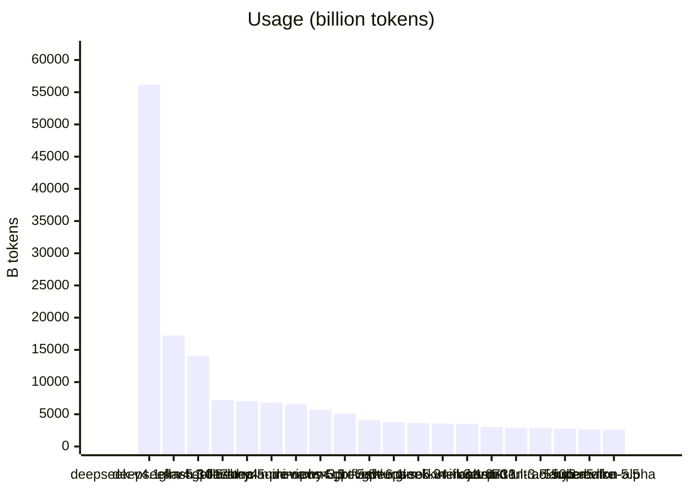
```mermaid
xychart-beta
    title "Usage (billion tokens)"
    x-axis ["deepseek-v4.1-flash-1017", "deepseek-v4.1-flash", "glm-5.3-flash", "gpt-6-luna", "hy4", "step-5-preview", "claude-opus-5.5", "minimax-m3.1-flash", "hy4-preview", "gpt-5.6-luna", "gpt-6.1-sol", "glm-5.3", "deepseek-v4-flash-0731", "kimi-k3.1-pro", "jev-1.13", "nemotron-3-ultra-550b-a5", "nemotron-3.5-super-vlfre", "hy3", "claude-haiku-5.5", "crouton-alpha"]
    y-axis "B tokens" 0 --> 61766
    bar [56151, 17238, 14059, 7221, 7055, 6828, 6592, 5672, 5109, 4066, 3755, 3628, 3561, 3527, 3028, 2909, 2900, 2765, 2657, 2618]
```

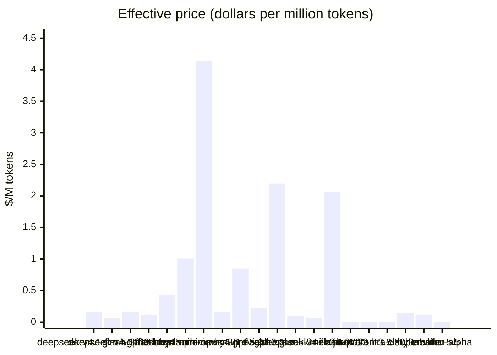
```mermaid
xychart-beta
    title "Effective price (dollars per million tokens)"
    x-axis ["deepseek-v4.1-flash-1017", "deepseek-v4.1-flash", "glm-5.3-flash", "gpt-6-luna", "hy4", "step-5-preview", "claude-opus-5.5", "minimax-m3.1-flash", "hy4-preview", "gpt-5.6-luna", "gpt-6.1-sol", "glm-5.3", "deepseek-v4-flash-0731", "kimi-k3.1-pro", "jev-1.13", "nemotron-3-ultra-550b-a5", "nemotron-3.5-super-vlfre", "hy3", "claude-haiku-5.5", "crouton-alpha"]
    y-axis "$/M tokens" 0 --> 4.55
    bar [0.156, 0.061, 0.159, 0.113, 0.425, 1.008, 4.138, 0.156, 0.849, 0.225, 2.199, 0.095, 0.068, 2.061, 0.000, 0.000, 0.000, 0.139, 0.122, 0.000]
```

### Cost against usage

Both axes are logarithmic, from the cheapest to the most expensive model ($0.0615 to $4.14 per million tokens) and from the least to the most used (2,657 to 56,151 billion tokens in the week). A dot's area grows with the model's estimated revenue (the largest: $37.3M a month; see the tables below). Free and unlisted models are not shown.

```mermaid
quadrantChart
    title Cost against usage
    x-axis Cheap --> Expensive
    y-axis Less used --> Most used
    quadrant-1 Expensive and popular
    quadrant-2 Cheap and popular
    quadrant-3 Cheap niche
    quadrant-4 Expensive niche
    deepseek-v4.1-flash-1017: [0.249, 0.950] radius: 11.3
    deepseek-v4.1-flash: [0.050, 0.602] radius: 9.9
    glm-5.3-flash: [0.253, 0.541] radius: 9.4
    gpt-6-luna: [0.180, 0.345] radius: 8.1
    hy4: [0.464, 0.338] radius: 8.9
    step-5-preview: [0.648, 0.328] radius: 10.4
    claude-opus-5.5: [0.950, 0.318] radius: 22.0
    minimax-m3.1-flash: [0.250, 0.274] radius: 6.6
    hy4-preview: [0.611, 0.243] radius: 8.4
    gpt-5.6-luna: [0.327, 0.175] radius: 7.9
    gpt-6.1-sol: [0.815, 0.152] radius: 13.1
    glm-5.3: [0.142, 0.142] radius: 9.2
    deepseek-v4-flash-0731: [0.072, 0.136] radius: 6.9
    kimi-k3.1-pro: [0.801, 0.134] radius: 11.0
    hy3: [0.224, 0.062] radius: 6.3
    claude-haiku-5.5: [0.196, 0.050] radius: 7.1
```

### Estimated revenue

What the models earned through OpenRouter in the week, estimated from the snapshot: input tokens times the input price the community paid on average, plus output tokens times the output list price. Monthly figures are the week times 4.35. The split between input and output is not assumed: OpenRouter reports both for each model. Input dominates everywhere, 92.4% to 99.5% of the tokens (median 98.6%), typical of coding agents that send their whole context with every request. Most of that input is cached, and cached input costs a fraction of the list price; OpenRouter's rankings page lists the average input price that was actually paid (known for 16 of 16 models here; where it is not, the list price is used, an upper bound). **Cache hits** is the share of input that must have come from the cache to give that average.

These are rough estimates: they cover OpenRouter only (not the vendors' own APIs or other resellers), list prices may have changed during the week, and the money is shared between OpenRouter and the provider that served the model.

| # | Model | Vendor | Country | Tokens (B/week) | Requests (M/week) | k tokens/request | Input share | In $/M list | In $/M paid | Cache hits | Out $/M | Revenue/week | Revenue/month | Share |
|--:|---|---|---|--:|--:|--:|--:|--:|--:|--:|--:|--:|--:|--:|
| 1 | anthropic/claude-opus-5.5 | Anthropic | USA | 6,592 | 54.8 | 120 | 99.1% | 4.000 | 1.138 | 75% | 20.00 | $8.6M | $37.3M | 43.5% |
| 2 | openai/gpt-6.1-sol | OpenAI | USA | 3,755 | 150.4 | 25 | 97.5% | 2.000 | 0.341 | 87% | 10.00 | $2.2M | $9.5M | 11.1% |
| 3 | deepseek/deepseek-v4.1-flash-1017 | DeepSeek | China | 56,151 | 888.3 | 63 | 98.6% | 0.150 | 0.017 | 90% | 0.60 | $1.4M | $6.1M | 7.1% |
| 4 | moonshotai/kimi-k3.1-pro | Moonshot AI | China | 3,527 | 27.0 | 131 | 99.2% | 2.000 | 0.297 | 95% | 10.00 | $1.3M | $5.7M | 6.6% |
| 5 | stepfun/step-5-preview | StepFun | China | 6,828 | 26.5 | 258 | 99.5% | 1.000 | 0.146 | 95% | 2.70 | $1.1M | $4.7M | 5.4% |
| 6 | deepseek/deepseek-v4.1-flash | DeepSeek | China | 17,238 | 521.3 | 33 | 98.0% | 0.051 | 0.042 | 27% | 0.57 | $908k | $3.9M | 4.6% |
| 7 | z-ai/glm-5.3-flash | Z.ai | China | 14,059 | 483.2 | 29 | 97.5% | 0.150 | 0.044 | 88% | 0.50 | $775k | $3.4M | 3.9% |
| 8 | z-ai/glm-5.3 | Z.ai | China | 3,628 | 70.7 | 51 | 98.1% | 0.070 | 0.175 | - | 1.40 | $717k | $3.1M | 3.6% |
| 9 | tencent/hy4 | Tencent | China | 7,055 | 49.7 | 142 | 99.0% | 0.417 | 0.079 | 85% | 1.25 | $638k | $2.8M | 3.2% |
| 10 | tencent/hy4-preview | Tencent | China | 5,109 | 46.5 | 110 | 99.1% | 0.834 | 0.077 | 96% | 2.50 | $506k | $2.2M | 2.6% |
| 11 | openai/gpt-6-luna | OpenAI | USA | 7,221 | 535.0 | 13 | 96.8% | 0.100 | 0.048 | 57% | 0.50 | $452k | $2.0M | 2.3% |
| 12 | openai/gpt-5.6-luna | OpenAI | USA | 4,066 | 147.5 | 28 | 97.5% | 0.200 | 0.071 | 72% | 1.20 | $401k | $1.7M | 2.0% |
| 13 | anthropic/claude-haiku-5.5 | Anthropic | USA | 2,657 | 197.0 | 13 | 94.5% | 0.100 | 0.070 | 33% | 0.50 | $248k | $1.1M | 1.3% |
| 14 | deepseek/deepseek-v4-flash-0731 | DeepSeek | China | 3,561 | 345.2 | 10 | 94.7% | 0.055 | 0.049 | 33% | 0.30 | $221k | $959k | 1.1% |
| 15 | minimax/minimax-m3.1-flash | MiniMax | China | 5,672 | 65.0 | 87 | 98.6% | 0.150 | 0.024 | 93% | 0.60 | $182k | $791k | 0.9% |
| 16 | tencent/hy3 | Tencent | China | 2,765 | 34.9 | 79 | 98.4% | 0.132 | 0.041 | 92% | 0.53 | $136k | $590k | 0.7% |

### Revenue by vendor

All listed models of the rankings, summed by vendor; free variants count with their tokens but earn nothing. Unlisted models (typesafe/jev-1.13) are left out: their price is unknown.

| # | Vendor | Models | Tokens (B/week) | Free tokens | Revenue/month | Share | Revenue per M tokens |
|--:|---|--:|--:|--:|--:|--:|--:|
| 1 | Anthropic | 2 | 9,249 | 0% | $38.4M | 44.7% | $0.954 |
| 2 | OpenAI | 3 | 15,042 | 0% | $13.2M | 15.4% | $0.202 |
| 3 | DeepSeek | 3 | 76,949 | 0% | $11.0M | 12.8% | $0.033 |
| 4 | Z.ai | 2 | 17,686 | 0% | $6.5M | 7.6% | $0.084 |
| 5 | Moonshot AI | 1 | 3,527 | 0% | $5.7M | 6.6% | $0.370 |
| 6 | Tencent | 3 | 14,929 | 0% | $5.6M | 6.5% | $0.086 |
| 7 | StepFun | 1 | 6,828 | 0% | $4.7M | 5.4% | $0.157 |
| 8 | MiniMax | 1 | 5,672 | 0% | $791k | 0.9% | $0.032 |
| 9 | NVIDIA | 2 | 5,808 | 100% | $0 | 0.0% | $0.000 |
| 10 | stealth | 1 | 2,618 | 0% | $0 | 0.0% | $0.000 |

### Revenue by country

The same, summed by the country of the vendor's headquarters.

| # | Country | Models | Tokens (B/week) | Free tokens | Revenue/month | Share | Revenue per M tokens |
|--:|---|--:|--:|--:|--:|--:|--:|
| 1 | USA | 7 | 30,099 | 19% | $51.6M | 60.1% | $0.394 |
| 2 | China | 11 | 125,592 | 0% | $34.2M | 39.9% | $0.063 |
| 3 | unknown | 1 | 2,618 | 0% | $0 | 0.0% | $0.000 |

### Price history

List prices in dollars per million tokens (input / output) in each snapshot, for the paid models of the current rankings; "-" where a snapshot does not have the model (snapshots before 2026-10-31 hold only the models ranked that week). Rerun `omega openrouter-snapshot` from time to time to extend it.

| Model | 2026-10-10 | 2026-10-31 | 2026-11-03 | 2026-11-05 | 2026-11-06 | 2026-11-07 | Change |
|---|--:|--:|--:|--:|--:|--:|---|
| deepseek/deepseek-v4.1-flash-1017 | - | 0.15 / 0.6 | 0.3 / 1.2 | 0.3 / 1.2 | 0.3 / 1.2 | 0.15 / 0.6 | - |
| deepseek/deepseek-v4.1-flash | 0.3 / 1.2 | 0.045 / 0.5 | 0.045 / 0.5 | 0.045 / 0.5 | 0.0486 / 0.54 | 0.051 / 0.567 | -81% |
| z-ai/glm-5.3-flash | 0.15 / 0.5 | 0.0163 / 0.148 | 0.0285 / 0.0923 | 0.15 / 0.5 | 0.15 / 0.5 | 0.15 / 0.5 | - |
| openai/gpt-6-luna | 0.1 / 0.5 | 0.1 / 0.5 | 0.1 / 0.5 | 0.1 / 0.5 | 0.1 / 0.5 | 0.1 / 0.5 | - |
| tencent/hy4 | - | - | - | 0.417 / 1.25 | 0.417 / 1.25 | 0.417 / 1.25 | - |
| stepfun/step-5-preview | 1 / 2.7 | 1 / 2.7 | 1 / 2.7 | 1 / 2.7 | 1 / 2.7 | 1 / 2.7 | - |
| anthropic/claude-opus-5.5 | 4 / 20 | 4 / 20 | 4 / 20 | 4 / 20 | 4 / 20 | 4 / 20 | - |
| minimax/minimax-m3.1-flash | - | 0.15 / 0.6 | 0.15 / 0.6 | 0.15 / 0.6 | 0.15 / 0.6 | 0.15 / 0.6 | - |
| tencent/hy4-preview | 0.834 / 2.5 | 0.834 / 2.5 | 0.834 / 2.5 | 0.834 / 2.5 | 0.834 / 2.5 | 0.834 / 2.5 | - |
| openai/gpt-5.6-luna | 0.2 / 1.2 | 0.2 / 1.2 | 0.2 / 1.2 | 0.2 / 1.2 | 0.2 / 1.2 | 0.2 / 1.2 | - |
| openai/gpt-6.1-sol | 2 / 10 | 2 / 10 | 2 / 10 | 2 / 10 | 2 / 10 | 2 / 10 | - |
| z-ai/glm-5.3 | 0.039 / 4.8 | 0.0699 / 1.4 | 0.08 / 3.6 | 0.0699 / 1.4 | 0.0699 / 1.4 | 0.0699 / 1.4 | -26% |
| deepseek/deepseek-v4-flash-0731 | 0.0066 / 1.28 | 0.119 / 0.238 | 0.059 / 0.3 | 0.059 / 0.3 | 0.059 / 0.3 | 0.0553 / 0.3 | -8% |
| moonshotai/kimi-k3.1-pro | - | 2 / 10 | 2 / 10 | 2 / 10 | 2 / 10 | 2 / 10 | - |
| tencent/hy3 | 0.132 / 0.528 | 0.132 / 0.528 | 0.132 / 0.528 | 0.132 / 0.528 | 0.132 / 0.528 | 0.132 / 0.528 | - |
| anthropic/claude-haiku-5.5 | - | 0.1 / 0.5 | 0.1 / 0.5 | 0.1 / 0.5 | 0.1 / 0.5 | 0.1 / 0.5 | - |
| stealth/crouton-alpha | - | - | - | 0 / 0 | 0 / 0 | 0 / 0 | - |

**Change** compares the first and the last known price, blended at the model's share of input tokens in the current week.

#### Prices over time, by vendor

Each model's price as one number per million tokens, blended at its share of input tokens in the current week; the x-axis lists the snapshot dates, evenly spaced rather than to scale.

##### Anthropic

```mermaid
xychart-beta
    title "claude-opus-5.5: $ per million tokens at 99% input"
    x-axis ["2026-10-10", "2026-10-31", "2026-11-03", "2026-11-05", "2026-11-06", "2026-11-07"]
    y-axis "$/M tokens" 0 --> 4.76
    line [4.138, 4.138, 4.138, 4.138, 4.138, 4.138]
```

```mermaid
xychart-beta
    title "claude-haiku-5.5: $ per million tokens at 95% input"
    x-axis ["2026-10-31", "2026-11-03", "2026-11-05", "2026-11-06", "2026-11-07"]
    y-axis "$/M tokens" 0 --> 0.14
    line [0.1218, 0.1218, 0.1218, 0.1218, 0.1218]
```

##### DeepSeek

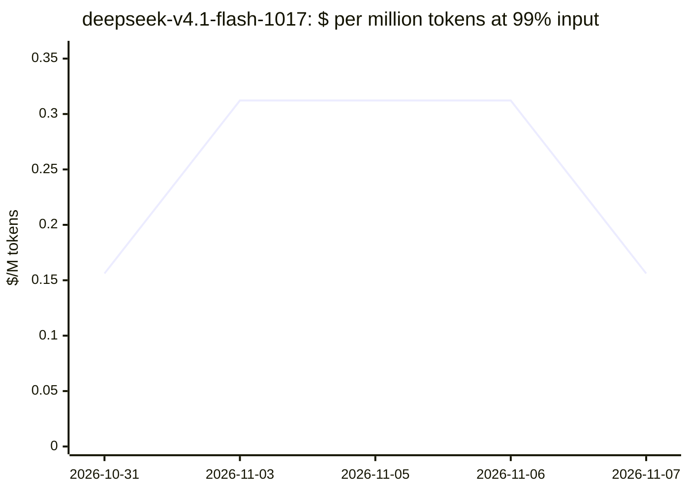
```mermaid
xychart-beta
    title "deepseek-v4.1-flash-1017: $ per million tokens at 99% input"
    x-axis ["2026-10-31", "2026-11-03", "2026-11-05", "2026-11-06", "2026-11-07"]
    y-axis "$/M tokens" 0 --> 0.359
    line [0.1561, 0.3122, 0.3122, 0.3122, 0.1561]
```

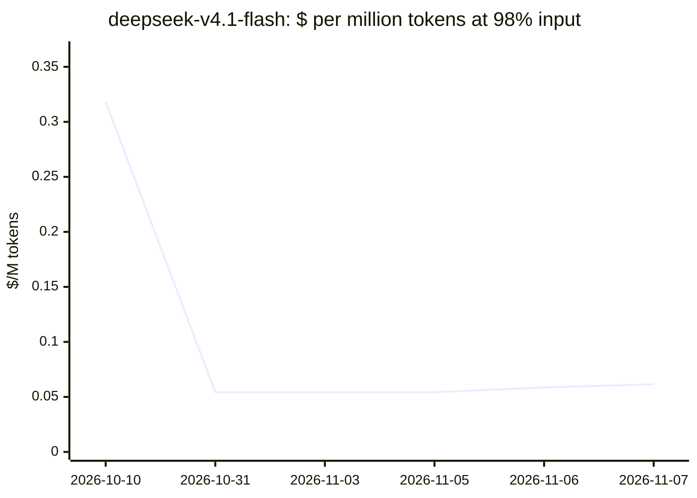
```mermaid
xychart-beta
    title "deepseek-v4.1-flash: $ per million tokens at 98% input"
    x-axis ["2026-10-10", "2026-10-31", "2026-11-03", "2026-11-05", "2026-11-06", "2026-11-07"]
    y-axis "$/M tokens" 0 --> 0.366
    line [0.3183, 0.05425, 0.05425, 0.05425, 0.05859, 0.0615]
```

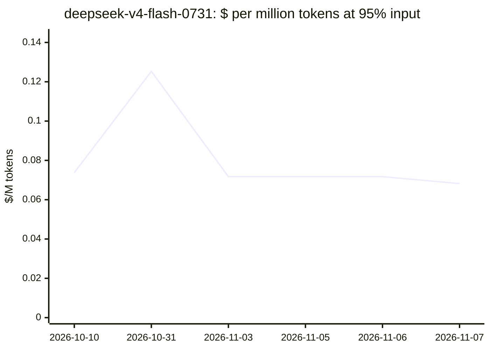
```mermaid
xychart-beta
    title "deepseek-v4-flash-0731: $ per million tokens at 95% input"
    x-axis ["2026-10-10", "2026-10-31", "2026-11-03", "2026-11-05", "2026-11-06", "2026-11-07"]
    y-axis "$/M tokens" 0 --> 0.144
    line [0.07378, 0.1253, 0.07171, 0.07171, 0.07171, 0.06821]
```

##### MiniMax

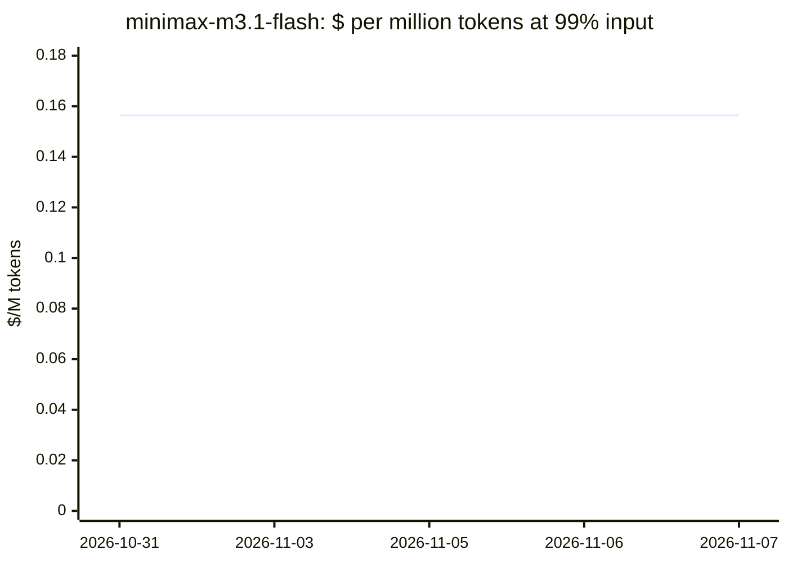
```mermaid
xychart-beta
    title "minimax-m3.1-flash: $ per million tokens at 99% input"
    x-axis ["2026-10-31", "2026-11-03", "2026-11-05", "2026-11-06", "2026-11-07"]
    y-axis "$/M tokens" 0 --> 0.18
    line [0.1564, 0.1564, 0.1564, 0.1564, 0.1564]
```

##### Moonshot AI

```mermaid
xychart-beta
    title "kimi-k3.1-pro: $ per million tokens at 99% input"
    x-axis ["2026-10-31", "2026-11-03", "2026-11-05", "2026-11-06", "2026-11-07"]
    y-axis "$/M tokens" 0 --> 2.37
    line [2.061, 2.061, 2.061, 2.061, 2.061]
```

##### OpenAI

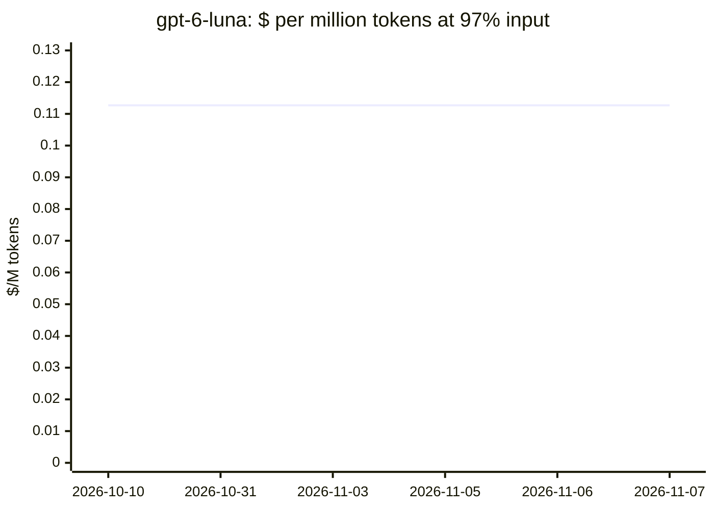
```mermaid
xychart-beta
    title "gpt-6-luna: $ per million tokens at 97% input"
    x-axis ["2026-10-10", "2026-10-31", "2026-11-03", "2026-11-05", "2026-11-06", "2026-11-07"]
    y-axis "$/M tokens" 0 --> 0.13
    line [0.1127, 0.1127, 0.1127, 0.1127, 0.1127, 0.1127]
```

```mermaid
xychart-beta
    title "gpt-5.6-luna: $ per million tokens at 98% input"
    x-axis ["2026-10-10", "2026-10-31", "2026-11-03", "2026-11-05", "2026-11-06", "2026-11-07"]
    y-axis "$/M tokens" 0 --> 0.258
    line [0.2246, 0.2246, 0.2246, 0.2246, 0.2246, 0.2246]
```

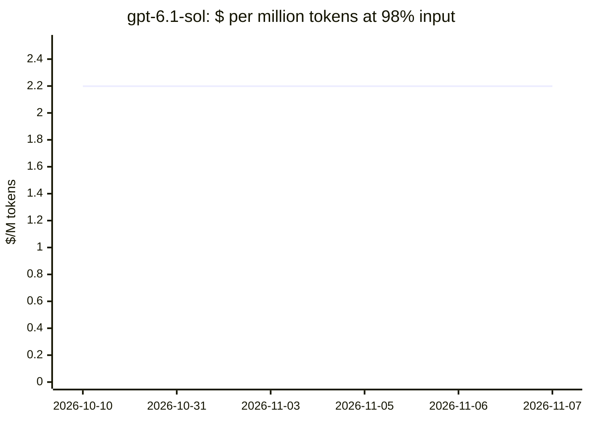
```mermaid
xychart-beta
    title "gpt-6.1-sol: $ per million tokens at 98% input"
    x-axis ["2026-10-10", "2026-10-31", "2026-11-03", "2026-11-05", "2026-11-06", "2026-11-07"]
    y-axis "$/M tokens" 0 --> 2.53
    line [2.199, 2.199, 2.199, 2.199, 2.199, 2.199]
```

##### StepFun

```mermaid
xychart-beta
    title "step-5-preview: $ per million tokens at 100% input"
    x-axis ["2026-10-10", "2026-10-31", "2026-11-03", "2026-11-05", "2026-11-06", "2026-11-07"]
    y-axis "$/M tokens" 0 --> 1.16
    line [1.008, 1.008, 1.008, 1.008, 1.008, 1.008]
```

##### Tencent

```mermaid
xychart-beta
    title "hy4: $ per million tokens at 99% input"
    x-axis ["2026-11-05", "2026-11-06", "2026-11-07"]
    y-axis "$/M tokens" 0 --> 0.489
    line [0.4254, 0.4254, 0.4254]
```

```mermaid
xychart-beta
    title "hy4-preview: $ per million tokens at 99% input"
    x-axis ["2026-10-10", "2026-10-31", "2026-11-03", "2026-11-05", "2026-11-06", "2026-11-07"]
    y-axis "$/M tokens" 0 --> 0.976
    line [0.8491, 0.8491, 0.8491, 0.8491, 0.8491, 0.8491]
```

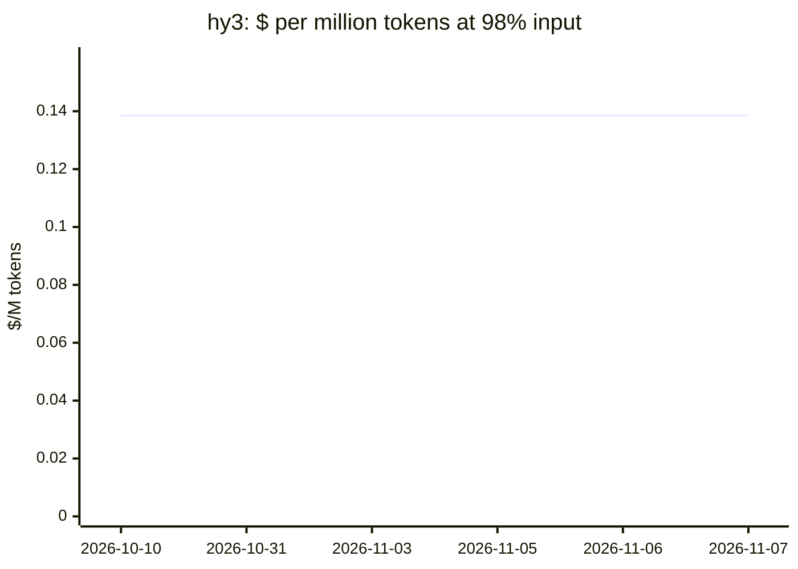
```mermaid
xychart-beta
    title "hy3: $ per million tokens at 98% input"
    x-axis ["2026-10-10", "2026-10-31", "2026-11-03", "2026-11-05", "2026-11-06", "2026-11-07"]
    y-axis "$/M tokens" 0 --> 0.159
    line [0.1385, 0.1385, 0.1385, 0.1385, 0.1385, 0.1385]
```

##### Z.ai

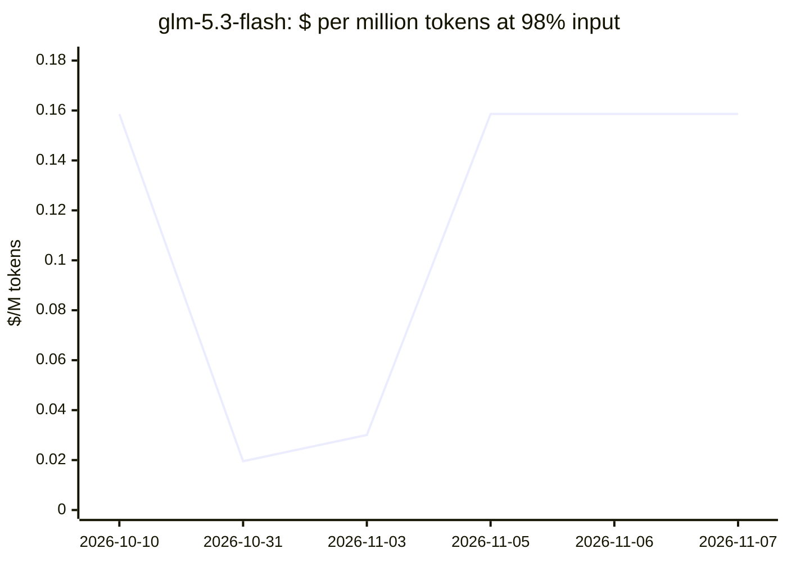
```mermaid
xychart-beta
    title "glm-5.3-flash: $ per million tokens at 98% input"
    x-axis ["2026-10-10", "2026-10-31", "2026-11-03", "2026-11-05", "2026-11-06", "2026-11-07"]
    y-axis "$/M tokens" 0 --> 0.182
    line [0.1586, 0.01953, 0.03006, 0.1586, 0.1586, 0.1586]
```

```mermaid
xychart-beta
    title "glm-5.3: $ per million tokens at 98% input"
    x-axis ["2026-10-10", "2026-10-31", "2026-11-03", "2026-11-05", "2026-11-06", "2026-11-07"]
    y-axis "$/M tokens" 0 --> 0.167
    line [0.1273, 0.09456, 0.1453, 0.09456, 0.09456, 0.09456]
```

##### stealth

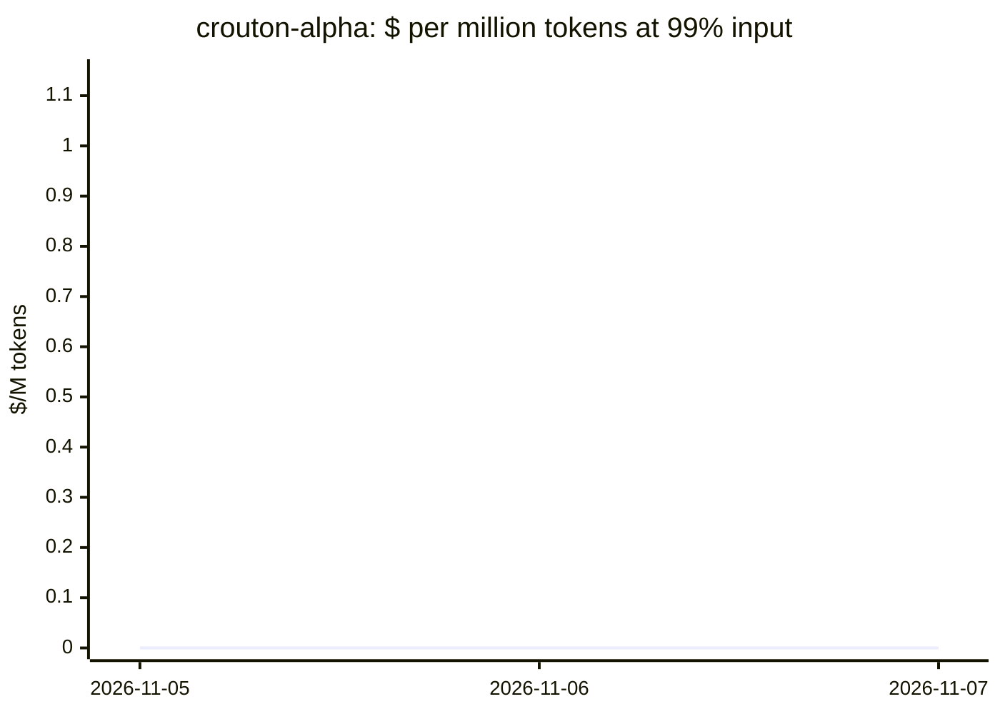
```mermaid
xychart-beta
    title "crouton-alpha: $ per million tokens at 99% input"
    x-axis ["2026-11-05", "2026-11-06", "2026-11-07"]
    y-axis "$/M tokens" 0 --> 1.15
    line [0, 0, 0]
```
